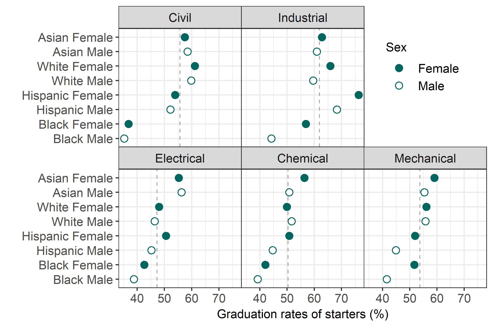
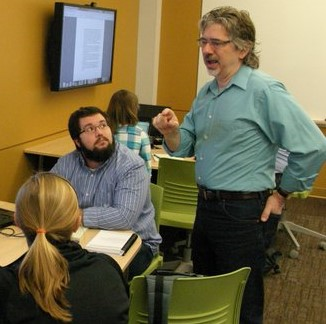

**Data graphics**

I started doing data visualization work with an engineering education research group around 2008 and haven't stopped. The iterative process we developed to  "find the story" in our data has been instrumental in shaping my approach to data graphics. You can read more about our research at [https://midfield.online/](https://midfield.online/). 

{width=60%}

I occasionally write about visual rhetoric, graph design, and R on my [Data Stories](https://graphdr.github.io/data-stories/) blog.  Our day 3 case study is built on one of those essays. 

**Music**

My dad was a guitar player and taught me my first chords. I've been songwriting and performing since my teens. I posted some draft tracks to [SoundCloud](https://soundcloud.com/richardlaytonmusic).

{width=30%}

A favorite musical pilgrimage is the annual [Swannanoa Gathering](https://swangathering.com/) near Asheville, NC in late July.

**Work life**

I am a graduate of California State University, Northridge (1991), and the University of Washington (1993, 1995), all in mechanical engineering. I taught at Rose-Hulman Institute of Technology from 2000-2020. My favorite courses were design, system dynamics, measurement systems, and data visualization. I retired from teaching in 2020. 

{width=30%}

**Links**

blog <https://graphdr.github.io/data-stories/>    
repo <https://github.com/graphdr>    
mail <a href="mailto:graphdoctor@gmail.com">graphdoctor@gmail.com</a>   
