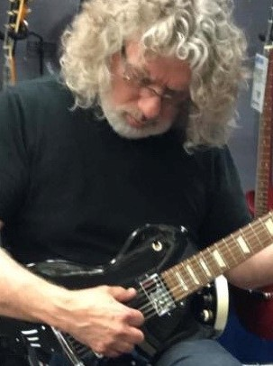

{width=30%}

**Data graphics**

I started doing data visualization work with an engineering education research group around 2008 and haven't stopped. The iterative process we developed to  "find the story" in our data has been instrumental in shaping my approach to data graphics. You can read more about our research at [https://midfield.online/](https://midfield.online/). 

I occasionally write about visual rhetoric, graph design, and R on my [Data Stories](https://graphdr.github.io/data-stories/) blog.  

**Music**

My dad was a guitar player and taught me my first chords. I've been songwriting and performing since my teens. A favorite musical pilgrimage is the annual [Swannanoa Gathering](https://swangathering.com/) near Asheville, NC in late July. I've posted some draft tracks to [SoundCloud](https://soundcloud.com/richardlaytonmusic). 

**Work life**

I am a graduate of California State University, Northridge (1991), and the University of Washington (1993, 1995). I taught mechanical engineering courses at Rose-Hulman Institute of Technology from 2000-2020. I retired from teaching in 2020. I also spent some years in industry, primarily in consulting engineering in Anchorage, AK, and Simi Valley, CA, with shorter stints at aerospace firms in Redmond, WA and West Palm Beach, FL.
