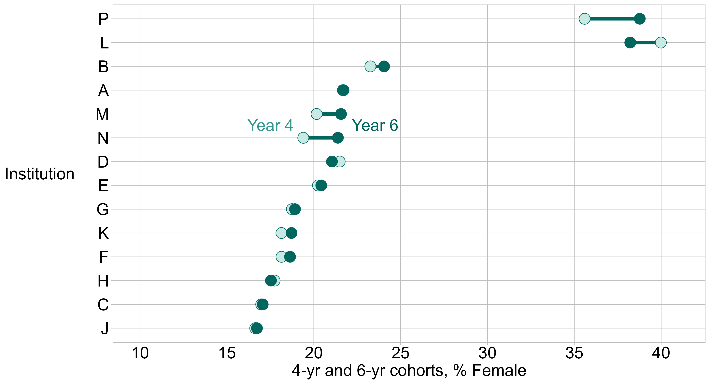

```{marginfigure, echo=TRUE}
*Richard Layton* resides online at 

- <https://www.graphdoctor.com>    
- <https://github.com/graphdr>    
```

```{r setup, include=FALSE}
knitr::opts_chunk$set(echo=FALSE, warning=FALSE, message=FALSE)
knitr::opts_knit$set(root.dir = "../")

library(data.table)
library(ggplot2)
library(knitr)
library(graphclassmate)
library(magick)
library(docxtools)

library(tufte)
library(tufterhandout)
# invalidate cache when the tufte version changes
knitr::opts_chunk$set(cache.extra = packageVersion('tufte'))
options(htmltools.dir.version = FALSE)

options(
  datatable.print.nrows = 16,
  datatable.print.topn = 6,
  datatable.print.class = TRUE
)
```


```{r fig.height = 0.1}
put_gap()
```


# Variables, design, message

```{marginfigure, echo=TRUE}
_Trees, Maps, and Theorems_ by Jean-luc Doumont (2009) inspired the four main topics. 
```

{width="70%"}

```{r fig.height = 2.5}
put_gap()
```


# `r "\U00A7"` Comparing data

## [4] Data

```{marginfigure, echo=TRUE}
Square brackets *[N]*  give the slide number. 
```

Representation at graduation in 3 engineering programs, 19 US institutions, 1987--2018

```{r}
#| comment: NULL
dt <- fread("data/session-2-compare-repr-at-grad.csv")
dt[]
```

## [5] Dot chart

{width="140%"}

## [6] Add a second category

{width="140%"}

## [7] Exchange mapping of categorical variables

{width="140%"}

## [8] Logarithmic scale for orders of magnitude differences

{width="140%"}

## [9] One program per facet

{width="140%"}

## [10] Add a third category 

{width="140%"}

## [11] Combine categories

{width="140%"}


## [12] Discussion: Comparing data

What points seem most important to you so far?

```{r fig.height=0.5}
put_gap()
```

```{marginfigure, echo=TRUE}

```


# `r "\U00A7"` Revealing correlations

## [14] Data

Engineering students persisting thru year 4 and graduating by year 6

```{r}
#| comment: NULL
options(
  datatable.print.nrows = 6,
  datatable.print.topn = 3
)
dt <- fread("data/session-2-correlate-persisters.csv")
tbl <- copy(dt)
setnames(tbl, old = c("persist_8" ,"grad_6"), new = c("yr_4", "yr_6"))
tbl <- dcast(tbl, institution ~ sex, value.var = c("yr_4","yr_6"))
tbl[, institution := paste("Institution", institution)]
tbl[]
```

## [15] Scatterplots are designed to reveal correlation

{width="53%"}

## [16] Add a category

{width="53%"}

## [17] One facet per sex

{width="120%"}

```{r fig.height=1}
put_gap()
```


## [18] One facet per institution

{width="120%"}

## [19] Change the quantitative variable

{width="120%"}


```{r fig.height=2}
put_gap()
```


## [20] Discussion: Revealing correlations

- We saw a correlation.

- We changed the emphasis.

- Which chart tells a more compelling story?

```{marginfigure, echo=TRUE}

```

```{r fig.height=2}
put_gap()
```


# `r "\U00A7"` Showing evolution

## [22] Data

University of California: funding and percent White enrollment, 1999--2017

```{r}
#| comment: NULL
options(
  datatable.print.nrows = 10,
  datatable.print.topn = 3
)

# read from the blog data directory
dt <- fread("data/budget-justice.csv", 
            colClasses = list(double = c("year", "white_pct")))

# add governor names
dt[, gov := fcase(
  year < 2004, "Davis", 
  year >= 2004 & year < 2011, "Schwarzenegger", 
  year >= 2011, "Brown")]
setcolorder(dt, c("year", "gov"))
setnames(dt, 
         old = c("year", "gov", "white_pct", "fund_frac"), 
         new = c("Year", "Governor", "Pct_UG_White", "Funding_metric"))
dt[]
```

## [24] Two time series

{width="130%"}

## [25] Indexed time series

{width="130%"}

## [26] Parallel lines indicate possible correlation

{width="130%"}

## [27] Connected scatterplot

{width="130%"}

## [28] Data     

Extent of polar ice (millions sq km) 1979--2021

```{r}
#| comment: NULL
dt <- readRDS("data/time-series-cyclic.rds")
dt <- data.table(dt)
setcolorder(dt, c("hemis", "month", "year"))
dt[]
```

## [29] Cyclic time series

{width="150%"}

## [30] Add a category

{width="150%"}


## [31] Discussion: Showing evolution

- Which time series chart design might be used in your own work? 

- Explain.

```{marginfigure, echo=TRUE}

```

```{r fig.height=1}
put_gap()
```


# `r "\U00A7"` Displaying distributions

## [33] Data 

World speed skiing (km/hr) competitions  1953--1995

```{r}
#| comment: NULL
#| echo: false

options(
  datatable.print.nrows = 10,
  datatable.print.topn = 4
)

library("GDAdata")
x <- data.table(SpeedSki)
x <- x[, .(Year, Speed, Sex, Event)]
setcolorder(x, c("Event", "Year", "Sex"))
setkeyv(x, c("Event", "Year", "Sex"))
x[]
```

## [34] Strip chart

{width="140%"}

## [35] Add a category

{width="140%"}

## [36] Add a second category

{width="140%"}

## [37] Data

MIDFIELD graduates (N = 270k), enrolled in Engineering, excluding 10th and 90th quantiles

```{r}
#| comment: NULL
dt <- readRDS("data/boxplot-merge-category.rds")
dt[, sex := ifelse(sex_path %ilike% "female", "Female", "Male")]
dt <- dt[, .(path, sex, enrolled)]
setnames(dt, old = c("enrolled"), new = c("years_to_grad"))
setkeyv(dt, c("path", "sex"))
dt[]
```

## [38] Box and whisker chart

{width="140%"}

## [39] Add a category

{width="140%"}

## [40] Combine a second category

{width="140%"}


## [41] Discussion: Displaying distributions

What MIDFIELD distributions would you like to see:

- what quantitative variable?

- what categorical variables?

```{marginfigure, echo=TRUE}

```

```{r fig.height=2.5}
put_gap()
```


# `r "\U00A7"` Closing discussion 

## [43] Variables, design, message 

- For you, what was the muddiest point in the session? 

```{r fig.height=1}
put_gap()
```

- Is there a graph design you would have liked to have seen today? 

```{r fig.height=1}
put_gap()
```

- Is there a class of variables you would have liked to have seen today? 


# References
