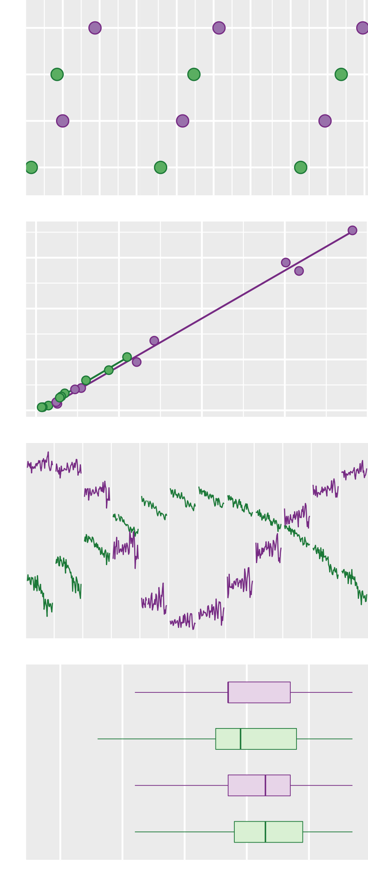
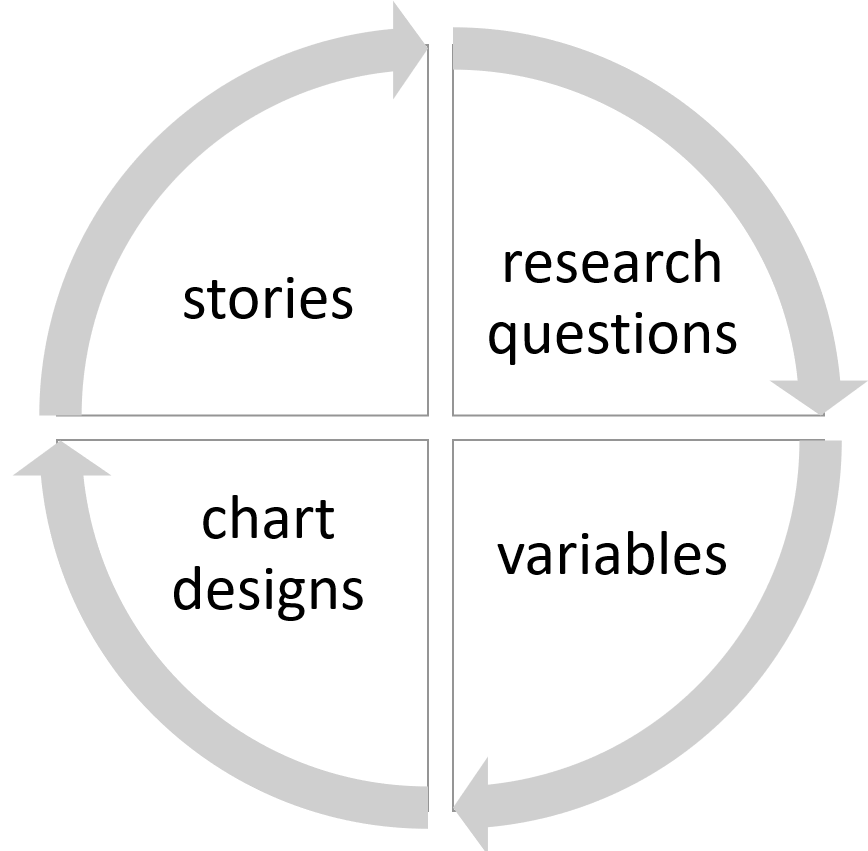

---
output:
  xaringan::moon_reader:
    css: ["default", "middlebury", "middlebury-fonts", "custom.css"]
    lib_dir: libs
    seal: false
    nature:
      highlightStyle: github
      highlightLines: true
      countIncrementalSlides: false
      slideNumberFormat: "%current%"
      ratio: 16:9
---

```{r setup, include=FALSE}
options(htmltools.dir.version = FALSE)
options(htmltools.dir.version = FALSE)
knitr::opts_chunk$set(echo=FALSE, warning=FALSE, message=FALSE)
knitr::opts_knit$set(root.dir = "../")

library("data.table")
library("ggplot2")
library("knitr")
library("kableExtra")
library("graphclassmate")
library("wrapr")
library("gapminder")
library("ggpubfigs") # color vision deficient inclusive palettes 

options(
  datatable.print.nrows = 16,
  datatable.print.topn = 6,
  datatable.print.class = TRUE
)

my_table <- function(x){
 x |>
  # kbl(col.names = NULL) |>
  kbl() |>
  kable_styling(position = "center", font_size = 20) |>
  # add_header_above(c("Variables" = ncol(x))) |>
  kable_paper(lightable_options = "basic", full_width = FALSE) |>
  row_spec(0, background = "#c7eae5") |>
  column_spec(1:dim(x)[2], 
              color = "black", 
              background = "white", 
              width = "1.75in")
  
  
  
}
uniform_point <- geom_point(size = 6, 
                            shape = 21, 
                            color = "black", 
                            fill = rcb("dark_Gray"))

uniform_point_2 <- geom_point(size = 3, 
                              shape = 21, 
                              alpha = 0.75, 
                              color = "black", 
                              fill = rcb("dark_Gray"))

uniform_color <- scale_color_manual(values = "black")
uniform_fill  <- scale_fill_manual(values = rcb("dark_Gray")) 

uniform_jitter <- geom_jitter(size = 6, 
                              shape = 21, 
                              alpha = 0.75, 
                              width = 0, 
                              height = 0.2)

superpose_point <- geom_point(size = 6, shape = 21)

superpose_color <- scale_color_manual(values = c(rcb("dark_Gn"),                                                              rcb("dark_PR")))
superpose_fill_mid <- scale_fill_manual(values = c(rcb("mid_Gn"), 
                                               rcb("mid_PR"))) 
superpose_fill_pale <- scale_fill_manual(values = c(rcb("pale_Gn"), 
                                               rcb("pale_PR"))) 
```

class: right

```{r}
library(magick)
a <- image_read("slides/img/dot-superpose-preview-v2.png")
b <- image_read("slides/img/scatterplot-preview.png")
c <- image_read("slides/img/time-series-cyclic-preview.png")
d <- image_read("slides/img/boxplot-preview.png")

z <- image_append(c(a, b), stack = TRUE)
z <- image_append(c(z, c), stack = TRUE)
z <- image_append(c(z, d), stack = TRUE)
image_write(z, 
        path = "slides/img/test-composite.png", 
        format = "png")
```


.left-column[

]

# Expanding your graphical repertoire

###  Variables, design, message

<br>

<br>

2022 MIDFIELD Institute

Richard Layton   

<br>

<br>

<https://www.graphdoctor.com>

<https://github.com/graphdr>

<a href="mailto:graphdoctor@gmail.com">graphdoctor@gmail.com</a>


---
class: left

.left-column[

]

#### $\quad$

#### $\quad$ Comparing data

#### $\quad$

<br>

#### $\quad$ Revealing correlations

#### $\quad$

<br>

#### $\quad$ Showing evolution

#### $\quad$

<br>

#### $\quad$ Displaying distributions


<div class="my-footer">
<span>
Optimal design categories from: Jean-luc Doumont (2009) <em>Trees, Maps and Theorems</em>, Principiae, p. 133.
</span>
</div> 


---
class:inverse, center, middle

# Comparing data


---
class: left

# Data

```{r}
#| include: false
# representation at graduation
# EAEEIC 2022 paper
# 19 universities in the USA for 1987 through 2018. 

d <- wrapr::build_frame(
"origin" , "sex", "Electrical Engr", "Computer Engr","Computer Science" |
"International" , "Female" ,	 1865 ,	 140 ,	 365 |
"International" , "Male"   ,	 8530 ,	 993 ,	1442 |
"Domestic"      , "Female" ,	23426 ,	 702 ,	2923 |
"Domestic"      , "Male"   ,	90150 ,	7481 ,	13987
)
d <- data.table(d)

fwrite(d, "data/session-2-compare-repr-at-grad.csv")
x <- copy(d)


d <- melt(d, id.vars = c("origin", "sex"), variable.name = "program", value.name = "N")
d[, origin_sex := paste(origin, sex)]
by_program <- d[, .(N = sum(N)), by = c("program")]
by_program_origin <- d[, .(N = sum(N)), by = c("program", "origin")]
by_program_sex <- d[, .(N = sum(N)), by = c("program", "sex")]
```

Representation at graduation in 3 engineering programs, 19 US institutions,   1987&ndash;2018

```{r}
setorder(x, origin, sex)
setnames(x, old = c("origin", "sex"), new = c("Origin", "Sex"))
x |>
  kableExtra::kbl(align = "llrrr") |>
  kableExtra::kable_paper(lightable_options = "basic", full_width = TRUE) |>
  kableExtra::row_spec(0, background = "#c7eae5") |>
  kableExtra::row_spec(0:4, font_size = 24) |>
  # kableExtra::column_spec(1, monospace = TRUE) |>
  kableExtra::column_spec(1:5, 
                          color = "black", 
                          background = "white")
```


<div class="my-footer">
<span>Data source: 2022 MIDFIELD  
</span>
</div> 


---
class: left

# Dot chart


```{r echo=FALSE, fig.width=16, fig.height=3.5}
p <- ggplot(by_program, aes(x = N/1000, y = reorder(program, N, median)))  +
  uniform_point + 
  uniform_color +
  uniform_fill +
  theme_graphclass(font_size = 20) +
  labs(x = "Number of graduates (thousands)", 
       y = "", title = "") +
  scale_x_continuous(limits = c(0, 150), breaks = seq(0, 150, 25))
p

ggsave(
  filename = "results/day-2-compare-01.png", 
  width = 16,
  height = 3,
  units = c("in"),
  dpi = 300
)
```

<br>

```{r echo=FALSE}
x <- build_frame(
   "variable" , "type"   |
   "program"  , "categorical" |
   "count of graduates", "quantitative")
my_table(x)
```


---
class: left

# Add a second category 


```{r echo=FALSE, fig.width=16, fig.height=3.5}
dt <- copy(by_program_origin)
p <- ggplot(dt, aes(x = N/1000, y = reorder(program, N, median), color = origin, fill = origin)) +
  superpose_point + 
  superpose_color +
  superpose_fill_mid +
  theme_graphclass(font_size = 20) +
  labs(x = "Number of graduates (thousands)", 
       y = "", title = "") +
  scale_x_continuous(limits = c(0, 150), breaks = seq(0, 150, 25)) +
  theme(legend.position = "none") +
  annotate("text",
           x = c(13, 116),
           y = 3,
           label = c("International", "Domestic"),
           size = 7,
           hjust = 0, vjust = 0.5)
p

ggsave(
  filename = "results/day-2-compare-02.png", 
  width = 16,
  height = 3,
  units = c("in"),
  dpi = 300
)
```


<br>

```{r echo=FALSE}
x <- wrapr::build_frame(
   "variable" , "type"   |
    "program", "categorical" |
    "origin", "categorical" |
    "count of graduates", "quantitative" 
)
my_table(x)
```


---
class: left

# Exchange mapping of categorical variables

```{r echo=FALSE, fig.width=16, fig.height=3.5}
dt <- copy(by_program_origin)
p <- ggplot(dt, aes(x = N/1000, y = reorder(origin, N, median), color = program, fill = program)) +
  superpose_point + 
  # facet_wrap(vars(reorder(program, N, median)), ncol = 3) +
  theme_graphclass(font_size = 20) +
  labs(x = "Number of graduates (thousands)", 
       y = "", title = "") +
  scale_x_continuous(limits = c(0, 150), breaks = seq(0, 150, 25)) + 
  scale_color_manual(values = c(rcb("dark_Gn"), "black", rcb("dark_PR"))) +
  scale_fill_manual(values = c(rcb("mid_Gn"), rcb("mid_Gray"),  rcb("mid_PR"))) +
  theme(legend.position = "none") + 
  geom_text(data = dt[origin == "Domestic"],
            aes(x = N/1000, y = c(2.3, 2.3, 1.7), label = program),
            size = 7, 
            hjust = c(1, 0, 0), 
            vjust = 0.5)
p

ggsave(
  filename = "results/day-2-compare-03.png", 
  width = 16,
  height = 3,
  units = c("in"),
  dpi = 300
)
```

<br>

```{r echo=FALSE}
my_table(x)
```


---
class: left

# Logarithmic scale for orders of magnitude differences

```{r echo=FALSE, fig.width=16, fig.height=3.5}
p <- p +
  aes(x = log10(N), 
      y = reorder(origin, N, median), 
      color = program, 
      fill = program) +
  scale_x_continuous(limits = c(2, 6), breaks = seq(1, 6, 1)) +
  labs(x = "Number of graduates (log base 10)", 
       y = "", title = "") + 
  geom_text(data = dt[origin == "Domestic"],
            aes(x = log10(N), y = c(2.3, 2.3, 2.3), label = program),
            size = 7, 
            hjust = c(0, 1, 0), 
            vjust = 0.5)

p

ggsave(
  filename = "results/day-2-compare-04.png", 
  width = 16,
  height = 2.8,
  units = c("in"),
  dpi = 300
)
```

<br>

```{r}
my_table(x)
```


---
class: left

# One program per facet

```{r echo=FALSE, fig.width=16, fig.height=3.5}
dt <- copy(by_program_origin)
p <- ggplot(dt, aes(x = log10(N), y = reorder(origin, N, median))) +
  uniform_point + 
  facet_wrap(vars(reorder(program, N, median)), ncol = 3) +
  theme_graphclass(font_size = 20) +
  scale_x_continuous(limits = c(2, 6), breaks = seq(1, 6, 1)) +
  labs(x = "Number of graduates (log base 10)", 
       y = "") 
  # theme(legend.position = "none") 
  # annotate("text",
  #          x = c(10, 114),
  #          y = c(3.3, 3.3),
  #          label = c("International", "Domestic"),
  #          size = 6,
  #          hjust = c(0, 1))


p

ggsave(
  filename = "results/day-2-compare-05.png", 
  width = 16,
  height = 2.8,
  units = c("in"),
  dpi = 300
)
```

<br>

```{r echo=FALSE}
my_table(x)
```


---
class: left

# Add a third category

```{r echo=FALSE, fig.width=16, fig.height=3.5}
p <- ggplot(d, aes(x = log10(N), y = reorder(origin, N, median), color = sex, fill = sex)) +
  facet_wrap(vars(reorder(program, N, median)), ncol = 3) +
  superpose_point + 
  superpose_color +
  superpose_fill_mid +
  theme_graphclass(font_size = 20) +
  labs(x = "Number of graduates (log base 10)",
       y = "") +
  scale_x_continuous(limits = c(2, 6), breaks = seq(1, 6, 1)) +
  theme(legend.position = "none") + 
  geom_text(data = d[program == "Computer Engr" & origin == "Domestic"],
            aes(x = log10(N), y = c(2.3, 2.3), label = sex),
            size = 7, 
            hjust = 0, 
            vjust = 0.5)
p

ggsave(
  filename = "results/day-2-compare-06.png", 
  width = 16,
  height = 2.8,
  units = c("in"),
  dpi = 300
)
```

<br>

```{r echo=FALSE}
x <- wrapr::build_frame(
   "variable" , "type"   |
    "program", "categorical" |
    "origin", "categorical" |
     "sex", "categorical" |
    "count of graduates", "quantitative" 
)
my_table(x)
```


---
class: left

# Combine categories

```{r echo=FALSE, fig.asp=0.25, fig.width=16}
p <- ggplot(d, aes(x = log(N, base = 10), 
              y = reorder(origin_sex, N, median))) +
  uniform_point + 
  facet_wrap(vars(reorder(program, N, median)), ncol = 3) +
  theme_graphclass(font_size = 20) +
  labs(x = "Number of graduates (log base 10)", 
       y = "") +
  theme(legend.position = "none") + 
  scale_x_continuous(limits = c(2, 6), breaks = seq(1, 6, 1))

p

ggsave(
  filename = "results/day-2-compare-07.png", 
  width = 16,
  height = 3.2,
  units = c("in"),
  dpi = 300
)
```

<br>

```{r echo=FALSE}
x <- wrapr::build_frame(
  "variable", "type" |
    "origin/sex", "categorical" |
    "program", "categorical" |
    "count of graduates", "quantitative" 
)
my_table(x)
```


```{r}
# -------------------- COVER PAGE -------------------- 
p <- ggplot(d, aes(x = log(N, base = 10), 
              y = reorder(origin_sex, N, median), 
              color = sex, fill = sex)) +
  geom_point(shape = 21, size = 3) + 
  superpose_color +
  superpose_fill_mid +
  facet_wrap(vars(reorder(program, N, median)), ncol = 3) +
  theme(legend.position = "none", 
        axis.text  = element_blank(), 
        axis.ticks = element_blank(), 
        plot.margin = unit(c(0, 0, 0, 0), "lines"), 
        strip.text = element_blank(), 
        panel.spacing = unit(0, "lines")) +
  labs(x = "", y = "")

ggsave(filename = "slides/img/dot-superpose-preview-v2.png", 
       width = 3, 
       height = 1.8,
       units = "in")
```


---
class: left

# Discussion

.pull-left[

]
.pull-right[
<br>

## Comparing data 

What points seem most important to you so far?
]


---
class:inverse, center, middle

# Revealing correlations


---
class: left

# Data

Number of engineering students persisting through year 4 and graduating by year 6

```{r}
# Data source
# Ohland MW, Brawner CE, Camacho MM, Layton RA, Long RA, Lord SM, Wasburn MH (2011) Race, gender, and measures of success in engineering education. Journal of Engineering Education, 100(2):225–252.

d <- wrapr::build_frame(
  "institution","sex","persist_8","grad_6" |
1, "Female",  865,  836 |
1, "Male",   3564, 3421 |
2, "Female",  374,  236 |
2, "Male",    644,  325 |
3, "Female",  203,  158 |
3, "Male",    610,  405 |
4, "Female", 2744, 2620 |
4, "Male",   9539, 8840 |
5, "Female",  761,  686 |
5, "Male",   1362, 1097 |
6, "Female", 2194, 1976 |
6, "Male",   7929, 6847 |
7, "Female",  169,  155 |
7, "Male",   1174, 1032 |
8, "Female",  715,  626 |
8, "Male",   3034, 2375 |
9, "Female", 1506, 1475 |
9, "Male",   7529, 7260
)
d <- data.table(d)
fwrite(d, "data/session-2-correlate-persisters.csv")

tbl <- copy(d)
setnames(tbl, old = c("persist_8" ,"grad_6"), new = c("persist", "grad"))
tbl <- dcast(tbl, institution ~ sex, value.var = c("persist","grad"))
tbl[, institution := paste("Institution", institution)]
```


```{r}
tbl |>
  kbl(col.names = c(" ", "Female", "Male", "Female", "Male")) |>
  kable_styling(font_size = 18) |>
  add_header_above(c("Institution" = 1, "Persist through Year 4" = 2, "Graduate by Year 6" = 2), background = "#c7eae5") |>
  kable_paper(lightable_options = "basic", full_width = FALSE) |>
  row_spec(0, background = "#c7eae5") |>
  column_spec(1:5, 
              color = "black", 
              background = "white", 
              width = "1.5in")
```

<div class="my-footer">
<span>Data source: 2011 MIDFIELD  
</span>
</div> 


---
class: left

# Scatterplots are designed to reveal correlation

.pull-left[
```{r}
d$persist_8 <- d$persist_8 / 1000
d$grad_6 <- d$grad_6 / 1000

d_by_inst <- d[, .(persist_8 = sum(persist_8), grad_6 = sum(grad_6)), by = c("institution")]


p <- ggplot(d_by_inst, aes(x = persist_8, y = grad_6)) +
  geom_smooth(method = "lm", se = FALSE, size = 0.6, color = "gray") +
  geom_point(size = 6, shape = 21, color = rcb("dark_BG"), fill = rcb("mid_BG")) +
  coord_fixed(ratio = 1) +
  scale_x_continuous(limits = c(0, 15)) +
  scale_y_continuous(limits = c(0, 15)) +
  labs(x = "4-yr persisters (thousands)", 
       y = "6-yr completers (thousands)") + 
  theme_graphclass(font_size = 20) 

p

ggsave(
  filename = "results/day-2-correlation-01.png", 
  width = 6,
  height = 6,
  units = c("in"),
  dpi = 300
)
```
]
.pull-right[

<br>

```{r echo=FALSE}
x <- wrapr::build_frame(
  "variable", "type" |
    "institution", "categorical" |
    "4-yr persisters", "quantitative" |
    "6-yr completers", "quantitative" 
)
my_table(x)
```
]


---
class: left

# Add a category

.pull-left[
```{r}
p <- ggplot(d, aes(x = persist_8, y = grad_6, color = sex, fill = sex)) +
  geom_smooth(method = "lm", se = FALSE, size = 0.6) +
  superpose_point + 
  superpose_color +
  superpose_fill_mid +
  coord_fixed(ratio = 1) +
  scale_x_continuous(limits = c(0, 10), breaks = seq(0, 12, 2)) +
  scale_y_continuous(limits = c(0, 10), breaks = seq(0, 12, 2)) +
  labs(x = "4-yr persisters (thousands)", 
       y = "6-yr completers (thousands)") + 
  theme_graphclass(font_size = 20) +
  theme(legend.position = "none") +
  geom_text(data = d[institution == 4], 
            aes(x = persist_8, y = grad_6, label = sex), 
            vjust = -1, hjust = 1, size = 7)

p

ggsave(
  filename = "results/day-2-correlation-02.png", 
  width = 6,
  height = 6,
  units = c("in"),
  dpi = 300
)
```
]
.pull-right[

<br>

```{r echo=FALSE}
x <- wrapr::build_frame(
  "variable", "type" |
    "institution", "categorical" |
    "sex", "categorical" |
    "4-yr persisters", "quantitative" |
    "6-yr completers", "quantitative"
)
my_table(x)
```
]


```{r}
# -------------------- COVER PAGE -------------------- 
p <- ggplot(d, aes(x = persist_8, y = grad_6, color = sex, fill = sex)) +
  geom_smooth(method = "lm", se = FALSE, size = 0.5) +
  geom_point(size = 2, shape = 21) +
  superpose_color +
  superpose_fill_mid +
  theme(legend.position = "none", 
        axis.text  = element_blank(), 
        axis.ticks = element_blank(), 
        plot.margin = unit(c(0, 0, 0, 0), "lines"), 
        strip.text = element_blank(), 
        panel.spacing = unit(0, "lines")) +
  labs(x = "", y = "")

ggsave(filename = "slides/img/scatterplot-preview.png",
       width = 3,
       height = 1.8,
       units = "in")
```


---
class: left

# One facet per sex

```{r echo=FALSE, fig.width=16}
p <- ggplot(d, aes(x = persist_8, y = grad_6, color = sex, fill = sex)) +
  geom_smooth(method = "lm", se = FALSE, size = 0.6) +
  superpose_point + 
  superpose_color +
  superpose_fill_mid +
  facet_wrap(vars(sex))+
  coord_fixed(ratio = 1) +
  scale_x_continuous(limits = c(0, 10), breaks = seq(0, 12, 2)) +
  scale_y_continuous(limits = c(0, 10), breaks = seq(0, 12, 2)) +
  labs(x = "4-yr persisters (thousands)", 
       y = "6-yr completers (thousands)") + 
  theme_graphclass(font_size = 20) +
  theme(legend.position = "none")

p

ggsave(
  filename = "results/day-2-correlation-03.png", 
  width = 12,
  height = 6,
  units = c("in"),
  dpi = 300
)
```


---
class: left

# One facet per institution

```{r echo=FALSE, fig.width=16, fig.asp = 0.5}
dt <- copy(d)
dt[, institution := paste("Institution", institution)]
p <- ggplot(dt, aes(x = persist_8, y = grad_6, color = sex, fill = sex)) +
  geom_smooth(method = "lm", se = FALSE, size = 0.6) +
  superpose_point + 
  superpose_color +
  superpose_fill_mid +
  facet_wrap(vars(reorder(institution, grad_6, median)), 
             ncol = 5, 
             as.table = FALSE)+
  # coord_fixed(ratio = 1) +
  scale_x_continuous(limits = c(0, 10), breaks = seq(0, 12, 2)) +
  scale_y_continuous(limits = c(0, 10), breaks = seq(0, 12, 2)) +
  labs(x = "4-yr persisters (thousands)", 
       y = "6-yr completers (thousands)") + 
  theme_graphclass(font_size = 20) +
  theme(legend.position = "none") +
  geom_text(data = dt[institution == "Institution 1"], 
            aes(x = persist_8, y = grad_6, label = sex), 
            vjust = 0.5, hjust = c(-0.2, -0.4), size = 7)
p

p <- p +
  scale_x_continuous(limits = c(0, 10), breaks = seq(0, 8, 4)) +
  scale_y_continuous(limits = c(0, 10), breaks = seq(0, 8, 4))
ggsave(
  filename = "results/day-2-correlation-04.png", 
  width = 12,
  height = 6,
  units = c("in"),
  dpi = 300
)
```


---
class: left

# Change the quantitative variable

```{r echo=FALSE, fig.width=16, fig.asp = 0.4}
d_totals <- copy(d_by_inst)
setnames(d_totals, old = c("persist_8", "grad_6"), new = c("inst_persist", "inst_grad"))
d <- d_totals[d, on = c("institution")]
d[, persist := round(100 * persist_8 / inst_persist, 1)]
d[, grad := round(100 * grad_6 / inst_grad, 1)]
d <- d[, .(institution, sex, grad_6, persist, grad, persist_8)]
dt <- copy(d)
dt[, institution := paste("Institution", institution)]
dt <- dt[sex == "Female", .(institution, persist, grad, persist_8)]

p <- ggplot(dt) +
  geom_segment(data = dt, 
               aes(x = persist, 
               xend = grad, 
               y = reorder(institution, grad), 
               yend = reorder(institution, grad)), 
               size = 2, 
               color = rcb("dark_BG"))+
  geom_point(aes(x = persist, y = reorder(institution, grad)), 
             color = rcb("dark_BG"), 
             fill = rcb("light_BG"), 
             shape = 21, 
             size = 6) +
  geom_point(aes(x = grad, y = reorder(institution, grad)), 
             color = rcb("dark_BG"), 
             fill = rcb("dark_BG"), 
             shape = 21,  
             size = 6) +
  labs(y = "", 
       x = "4-yr and 6-yr cohorts, % Female") +
  geom_text(data = dt[institution == "Institution 3"],  
            aes(x = persist, y = institution, label = "Year 4"), 
            vjust = -0.8, 
            hjust = 1, 
            size = 7
            ) +
    geom_text(data = dt[institution == "Institution 3"],  
            aes(x = grad, y = institution, label = "Year 6"), 
            vjust = -0.8, 
            hjust = 0, 
            size = 7
            ) +
  scale_x_continuous(limits = c(10, 50), breaks = seq(0, 100, 10)) +
  theme_graphclass(font_size = 20)

p

ggsave(
  filename = "results/day-2-correlation-05.png", 
  width = 12,
  height = 5,
  units = c("in"),
  dpi = 300
)
```


---
class: left

# Discussion

.pull-left[

]
.pull-right[
<br>

## Revealing correlations 

We saw a correlation. 

We changed the emphasis.  

Which chart tells a more compelling story?  
]


---
class:inverse, center, middle

# Showing evolution


---
class: left

# Data

University of California: funding and percent White enrollment, 1999&ndash;2017


```{r}
# read from the blog data directory
dt <- fread("data/budget-justice.csv", 
            colClasses = list(double = c("year", "white_pct")))

# add governor names
dt[, gov := fcase(
  year < 2004, "Gray Davis", 
  year >= 2004 & year < 2011, "A. Schwarzenegger", 
  year >= 2011, "Jerry Brown")]
```

.pull-left[
```{r}
x <- copy(dt)
setcolorder(x, c("year", "gov"))
setnames(x, 
         old = c("year", "gov", "white_pct", "fund_frac"), 
         new = c("Year", "Governor", "% UG White", "Funding metric"))
x[, Year := as.character(Year)]
x[1:10] |>
  # kbl(col.names = NULL) |>
  kbl() |>
  kable_styling(position = "center", font_size = 18) |>
  # add_header_above(c("Variables" = ncol(x))) |>
  kable_paper(lightable_options = "basic", full_width = FALSE) |>
  row_spec(0, background = "#c7eae5") |>
  column_spec(1:dim(x)[2], 
              color = "black", 
              background = "white") |>
  column_spec(c(1), width = "0.6in") |>
  column_spec(c(2), width = "1.4in") |>
  column_spec(c(3, 4), width = "1.2in") 
```
]
.pull-right[
```{r}
x[11:19] |>
  # kbl(col.names = NULL) |>
  kbl() |>
  kable_styling(position = "center", font_size = 18) |>
  # add_header_above(c("Variables" = ncol(x))) |>
  kable_paper(lightable_options = "basic", full_width = FALSE) |>
  row_spec(0, background = "#c7eae5") |>
  column_spec(1:dim(x)[2], 
              color = "black", 
              background = "white") |>
  column_spec(c(1), width = "0.6in") |>
  column_spec(c(2), width = "1.4in") |>
  column_spec(c(3, 4), width = "1.2in") 
```
]


<div class="my-footer">
<span>Data source:  
C. Newfield (2021) Budget justice: Addressing the structural racism of higher education funding, <em>Academe</em> 107(2), 57--64.
</div> 


---
class: left

# Classify variables

```{r echo=FALSE}
x <- wrapr::build_frame(
  "variable", "type" |
    "year", "categorical" |
    "governor", "categorical" |
    "UC funding metric", "quantitative"  |
    "White undergraduate % enrollment", "quantitative"
)
my_table(x) |> 
  column_spec(1, width = "3in") |>
  column_spec(2, width = "2in")
```

<div class="my-footer">
<span>Data source:  
C. Newfield (2021) Budget justice: Addressing the structural racism of higher education funding, <em>Academe</em> 107(2), 57--64.
</div> 


---
class: left

# Two time series

```{r fig.width=16}
# transform to block record form
dt_melt <- melt(dt, 
                measure.vars  = c("white_pct", "fund_frac"), 
                variable.name = "data_series", 
                value.name    = "value")

# stand-alone data frame for annotating gubernatorial terms
gov_text <- data.frame(
  label = c("Davis", "Schwarzenegger", "Brown"),
  data_series = "fund_frac",
  x = c(2001, 2007.5, 2014),
  y = 0.38
)

# vector for relabeling the facets
facet_labels <- c("UC funding fraction of state personal income", 
                  "White undergraduate % enrollment")
names(facet_labels) <- c("fund_frac", "white_pct")

# chart
p <- ggplot(data = dt_melt, mapping = aes(x = year, y = value)) +
  facet_wrap(vars(data_series), 
             ncol = 2, 
             scales = "free_y", 
             labeller = labeller(data_series = facet_labels)) +
  geom_text(data = gov_text,
            mapping = aes(x = x, y = y, label = label),
            size = 7) +
  geom_line(size = 0.5, linetype = 2) +
  uniform_point +
  scale_x_continuous(breaks = c(1999, 2004, 2011, 2017),
                     minor_breaks = seq(1999, 2020, 1)) +
  labs(x = "Year", y = "") +
  theme_graphclass(font_size = 20) +
  theme(panel.grid.minor.y = element_blank())

p

ggsave(
  filename = "results/day-2-evolution-01.png", 
  width = 15,
  height = 6,
  units = c("in"),
  dpi = 300
)

```


---
class: left

# Indexed time series 

```{r fig.width=16}
# transform to block record form 
dt_idx <- melt(dt, 
               measure.vars = c("white_pct", "fund_frac"), 
               variable.name = "data_series", 
               value.name = "measure")

# compute percent change relative to 1999
setkeyv(dt_idx, c("data_series", "year"))
dt_idx[, idx := measure[1], by = c("data_series")]
dt_idx[, rel_change :=  100 * ((measure / idx) - 1)]

# create the base chart for all versions of indexed charts
p <- ggplot(data = dt_idx, 
            mapping = aes(x = year, y = rel_change, color = data_series)) +
  
  # 1999 baseline
  geom_segment(aes(x = 1999, xend = 2017, 
                   y = 0, yend = 0), 
                   color = "gray30", 
                   size = 0.5) +
  annotate("text",
           x = 2017,
           y = 0,
           label = "1999 baseline",
           hjust = 1,
           vjust = -0.5, 
           size = 7) +

  # delineate gubernatorial terms
  # geom_vline(xintercept = c(2004, 2011),
  #            color = "gray30",
  #            size = 0.5,
  #            linetype = 2) +
  geom_text(data = dt_idx[data_series == "fund_frac" & year %in% c(2001, 2008, 2014)],
            mapping = aes(y = -56, label = gov),
            color = "black", 
            size = 7) +

  # label the two data series
  annotate("text",
           x = 2005.5,
           y = c(-7, -29),
           label = c("White enrollment share", "Funding"),
           hjust = c(0, 0),
           vjust = c(0, 0), 
           size = 7) +

  # points, scales, labels, theme
  geom_point(size = 6) + 
  labs(x = "Year", y = "Percent change since 1999") +
  scale_color_manual(values = friendly_pal("contrast_three")) +
  scale_x_continuous(breaks = c(1999, 2004, 2011, 2017),
                     minor_breaks = seq(1999, 2020, 1)) +
  scale_y_continuous(breaks = seq(-50, 0, 10), limits = c(-56, 5)) +
  theme_graphclass(font_size = 20) +
  theme(panel.grid.minor.y = element_blank(),
        legend.position = "none")

# connect the dots for the first indexed chart
q <- p + geom_line(linetype = 1, size = 0.5)

q

ggsave(
  filename = "results/day-2-evolution-02.png", 
  width = 15,
  height = 6,
  units = c("in"),
  dpi = 300
)
```


---
class: left

# Parallel lines indicate possible correlation

```{r fig.width=16}
# leave enrollment fit as is
q <- p + geom_smooth(data = dt_idx[data_series == "white_pct"], 
                method = "lm", 
                se = FALSE, 
                size = 0.5) +
  
  # add regression lines by governor
  geom_smooth(data = dt_idx[data_series == "fund_frac" & year <= 2004],
              method = "lm", 
              se = FALSE, 
              size = 0.5) +
  geom_smooth(data = dt_idx[data_series == "fund_frac" & year %in% c(2004:2007, 2010:2011)],
              method = "lm",
              se = FALSE,
              size = 0.5) +
  geom_smooth(data = dt_idx[data_series == "fund_frac" & year >= 2011],
              method = "lm", 
              se = FALSE, 
              size = 0.5)

q

ggsave(
  filename = "results/day-2-evolution-03.png", 
  width = 15,
  height = 6,
  units = c("in"),
  dpi = 300
)
```


---
class:left

# Connected scatterplot

```{r fig.width=16}
# add end-of-term dummy rows grouping by governor
dum_row <- copy(dt)
dum_row <- dum_row[year == 2004 | year == 2011]
dum_row[year == 2004, gov := "Gray Davis"]
dum_row[year == 2011, gov := "A. Schwarzenegger"]
dt_conn <- rbindlist(list(dt, dum_row))

# add a column to ensure correct order
dt_conn[, order_gov := fcase(
  gov %chin% "Gray Davis", 1, 
  gov %chin% "A. Schwarzenegger", 2,
  gov %chin% "Jerry Brown", 3 
)]
setkeyv(dt_conn, c("year", "order_gov"))

# base plot for connected scatterplot. color = gov uses the dummy rows
p <- ggplot(dt_conn, aes(x = 100 - white_pct, 
                         y = fund_frac, 
                         color = gov, 
                         fill = gov)) +
  geom_point(size = 6, shape = 16) +
  labs(x = "Enrollment of students of color (%)", 
       y = "UC funding / State  personal income") +
  theme_graphclass(font_size = 20) +
  theme(legend.position = "none") +
  scale_color_manual(values = c(rcb("dark_BG"), 
                                rcb("dark_Gray"),  
                                rcb("dark_PR"))) +
  # label selected years with original dt
  geom_text(data = dt[year %in% c(1999, 2004, 2008, 2011, 2017)],
           aes(label = year), 
           color = "black", 
           nudge_x = 0.7  * c( 0,  -1, -1,  0,  0), 
           nudge_y = 0.01 * c(-1,   0, 0.5, -1, -1), 
           size = 7) +
  
  # label governors once per span
  geom_text(data = dt_conn[year %in% c(2001, 2008, 2014)], 
            mapping = aes(label = gov), 
            nudge_x = 0.5 * c(0, -1, 0), 
            nudge_y = 0.03 * c(-1, 2, -1), 
            fontface = "bold", 
            size = 7) 

# first connected scatterplot chart, connect the dots
q <- p + geom_path(linetype = 1, size = 0.5)
q

ggsave(
  filename = "results/day-2-evolution-04.png", 
  width = 15,
  height = 6,
  units = c("in"),
  dpi = 300
)
```


---
class:left

# Data

Extent of polar ice, 1979&ndash;2021

.pull-left[
```{r}
#| comment: NULL
options(datatable.print.topn = 10)

dt <- readRDS("data/time-series-cyclic.rds")
dt <- data.table(dt)
setcolorder(dt, c("hemis", "month", "year"))
dt[]
```
]
.pull-right[

```{r echo=FALSE}
x <- wrapr::build_frame(
  "variable", "type" |
    "hemisphere", "categorical" |
    "month", "categorical" |
    "year", "categorical" |
    "area of polar ice (millions sq km)", "quantitative"
)
my_table(x) |>
  column_spec(1, width = "3in") |>
  column_spec(2, width = "2in")
```
]


<div class="my-footer">
<span>Data source: NASA National Snow and Ice Data Center  
<a href="https://nsidc.org/arcticseaicenews/sea-ice-tools/">Sea ice extent and area organized by year</a></span>
</div> 


---
class:left

# Cyclic time series


```{r echo=FALSE, fig.width=16, fig.asp=0.4}
dt <- readRDS("data/time-series-cyclic.rds")
added_text <- copy(dt)
setkeyv(added_text, c("month", "year"))
added_text <- added_text[month == "February"]
added_text <- added_text[year == min(year) | year == max(year)]

dt <- dt[hemis == "Arctic"]
my_text <- dt[month == "September" & year == "1979"]

p <- ggplot(dt, aes(x = year, y = extent)) +
  geom_line(size = 1, na.rm = TRUE, color = rcb("dark_Gn")) +
  facet_wrap(vars(month), ncol = 12, strip.position = "bottom") +
  theme_minimal() +
  labs(x = "", 
       y =  expression(paste(10^6, " ", km^2)), 
       title= "Extent of polar ice for a given month, 1979-2021") +
  theme(axis.text.x = element_blank(), 
        axis.title.y = element_text(angle = 0, size = 20), 
        panel.grid.major.x = element_blank(), 
        panel.grid.minor.x = element_blank(), 
        strip.text = element_text(size = 16), # month labels
        axis.text = element_text(size = 20), 
        plot.title = element_text(size = 20)
        ) +
  geom_text(data = my_text,
            mapping = aes(x = year, 
                          y = extent + 2, 
                          label = hemis),
            hjust = 0,
            size = 7,
            color = rcb("mid_Gray")) +
  scale_y_continuous(limits = c(0, 20), breaks = seq(0, 20, 5)) +
    geom_text(data = added_text[hemis == "Arctic"],
           aes(x = year, y = extent, label = year),
           hjust = c(1.1, 0),
           vjust = c(-0.3, 1.8),
           size = 6,
           family = 2,
           color = rcb("dark_Gn")) +
  coord_cartesian(clip = "off")

p

ggsave(
  filename = "results/day-2-evolution-05.png", 
  width = 15,
  height = 6,
  units = c("in"),
  dpi = 300
)
```


---
class:left

# Add a category

```{r echo=FALSE, fig.width=16, fig.asp=0.4}
dt <- readRDS("data/time-series-cyclic.rds") 
my_text <- dt[month == "September" & year == "1979"]

p <- ggplot(dt, aes(x = year, y = extent, color = hemis)) +
  geom_line(size = 1, na.rm = TRUE) +
  facet_wrap(vars(month), ncol = 12, strip.position = "bottom") +
  theme_minimal() +
  labs(x = "", 
       y =  expression(paste(10^6, " ", km^2)), 
       title= "Extent of polar ice for a given month, 1979-2021") +
  theme(axis.text.x = element_blank(), 
        axis.title.y = element_text(angle = 0, size = 20), 
        panel.grid.major.x = element_blank(), 
        panel.grid.minor.x = element_blank(), 
        strip.text = element_text(size = 16), # months labels
        axis.text = element_text(size = 20), 
        plot.title = element_text(size = 20), 
        legend.position = "none"
        ) +
  scale_color_manual(values = c(rcb("dark_PR"), rcb("dark_Gn"))) +
  geom_text(data = my_text,
            mapping = aes(x = year, 
                          y = extent + c(2, -1.7), 
                          label = hemis),
            hjust = c(0, 0),
            size = 7, 
            color = rcb("mid_Gray")) +
  scale_y_continuous(limits = c(0, 20), breaks = seq(0, 20, 5)) +
    geom_text(data = added_text[hemis == "Arctic"],
           aes(x = year, y = extent, label = year),
           hjust = c(1.1, 0),
           vjust = c(-0.3, 1.8),
           size = 6,
           family = 2,
           color = rcb("dark_Gn")) +
  coord_cartesian(clip = "off")
p

ggsave(
  filename = "results/day-2-evolution-06.png", 
  width = 15,
  height = 6,
  units = c("in"),
  dpi = 300
)
```


```{r include=FALSE}
# -------------------- COVER PAGE -------------------- 
ggplot(dt, aes(x = year, y = extent, color = hemis)) +
  geom_line(size = 0.3, na.rm = TRUE) +
  facet_wrap(vars(month), ncol = 12) +
  labs(x = "", y = "") +
  scale_color_manual(values = c(rcb("dark_PR"), rcb("dark_Gn"))) +
  theme(legend.position = "none", 
        axis.text  = element_blank(), 
        axis.ticks = element_blank(), 
        plot.margin = unit(c(0, 0, 0, 0), "null"),
        panel.spacing = unit(0.04, "lines"),
        panel.grid.major.x = element_blank(), 
        panel.grid.minor.x = element_blank(), 
        panel.grid.major.y = element_blank(), 
        panel.grid.minor.y = element_blank(), 
        strip.text = element_blank())

ggsave(filename = "slides/img/time-series-cyclic-preview.png", 
       width = 3,
       height = 1.8,
       units = "in")
```


---
class: left

# Discussion

.pull-left[

]
.pull-right[
<br>

## Showing evolution 

Which time series chart design might

be used in your own work? Explain. 
]


---
class:inverse, center, middle

# Displaying distributions


---
class: left

# Data

World speed skiing competitions, 1953&ndash;1995

.pull-left[
```{r}
#| comment: NULL
#| echo: false
options(
  datatable.print.nrows = 16,
  datatable.print.topn = 10
)
# full distribution, jittered
library("GDAdata")

x <- data.table(SpeedSki)
x <- x[, .(Year, Speed, Sex, Event)]
setcolorder(x, c("Event", "Year", "Sex"))
setkeyv(x, c("Event", "Year", "Sex"))
x[]
```
]
.pull-right[

<br>

```{r}
#| echo: false

x <- wrapr::build_frame(
  "variable", "type" |
    "event", "categorical" |
    "year", "categorical" |
    "sex", "categorical" |
    "speed (km/hr)", "quantitative"
)
my_table(x) 
# |>
#   column_spec(1, width = "3in") |>
#   column_spec(2, width = "2in")
```
]

<div class="my-footer">
<span>Data source: 2011 World speed skiing competition, in the
<a href="https://CRAN.R-project.org/package=GDAdata">GDAdata</a> R package</span>
</div> 


---
class: left

# Strip chart

```{r, fig.asp = 0.15, fig.width = 16}
# for using uniform manual color and fill 
SpeedSki$dummy <- "dummy"
set.seed(20181216)
p <- ggplot(SpeedSki, aes(x = Speed, y = 0, color = dummy, fill = dummy)) +
  uniform_jitter +
  uniform_color +
  uniform_fill + 
  scale_y_continuous(limits = 1.5 * c(-1, 1)) +
  theme_graphclass(font_size = 20) +
  labs(x = "Speed (km/hr)", 
       y = "All events (1953–1995)") +
  theme(axis.text.y = element_blank(), 
        axis.title.y = element_text(angle = 0, vjust = 0.5), 
        panel.grid.major.y = element_blank(), 
        panel.grid.minor.y = element_blank(), 
        legend.position = "none")

p

ggsave(
  filename = "results/day-2-distributions-01.png", 
  width = 15,
  height = 2.5,
  units = c("in"),
  dpi = 300
)
```

<br>

```{r echo=FALSE}
x <- build_frame(
   "variable" , "type" |
   "speed"    , "quantitative")
my_table(x)
```


---
class: left

# Add a category

```{r, fig.asp = 0.2, fig.width = 16}
# full distribution, jittered
set.seed(20181216)


x <- data.table(SpeedSki)
x <- x[, .(Year, Event, Speed, Sex, dummy)]
y <- x[, .(Year, Event)]
y[, `:=` (start = min(Year), end = max(Year)), by = c("Event")]
y[, Event_yr := paste0(Event, " (", start, "-", end,  ")" )]
y <- y[, .(Event, Event_yr)]
y <- unique(y)
x <- y[x, on = c("Event")]


SpeedSki <- copy(x)

p <-ggplot(SpeedSki, aes(x = Speed, 
                     y = reorder(Event_yr, Speed, median), 
                     color = dummy,
                     fill = dummy
                     )) +
  uniform_jitter +
  uniform_color +
  uniform_fill + 
  theme_graphclass(font_size = 20) +
  labs(x = "Speed (km/hr)", 
       y = "") +
  theme(panel.grid.minor.y = element_blank(), 
        legend.position = "none")

p

ggsave(
  filename = "results/day-2-distributions-02.png", 
  width = 15,
  height = 3,
  units = c("in"),
  dpi = 300
)
```


```{r echo=FALSE}
x <- build_frame(
   "variable", "type" |
  "event", "categorical"|
   "speed", "quantitative" 

   )
my_table(x)
```


---
class: left

# Add a second category

```{r, fig.asp = 0.2, fig.width = 16}
# full distribution, jittered
set.seed(20181216)
p <- ggplot(SpeedSki, aes(x = Speed, 
                     y = reorder(Event_yr, Speed, median), 
                     color = Sex, 
                     fill = Sex)) +
  uniform_jitter +
  superpose_color + 
  superpose_fill_mid +
  theme_graphclass(font_size = 20) +
  labs(x = "Speed (km/hr)", 
       y = "") +
  theme(panel.grid.minor.y = element_blank(), 
        legend.position = "none") +
  geom_text(aes(x = 200, 
                y = 2.6, 
                label = "women"), 
            color = rcb("dark_Gn"), 
            size = 7) +
  geom_text(aes(x = 210, 
                y = 2.6, 
                label = "men"), 
            color = rcb("dark_PR"), 
            size = 7)
p

ggsave(
  filename = "results/day-2-distributions-03.png", 
  width = 15,
  height = 3,
  units = c("in"),
  dpi = 300
)
```


```{r echo=FALSE}
x <- build_frame(
   "variable"   , "type" |
   "event"      , "categorical", 
   "sex"        , "categorical"|
      "speed"      , "quantitative" )
my_table(x)
```


---
class: left

# Data

MIDFIELD graduates (N = 270k), enrolled in Engineering, excluding 10th and 90th quantiles

.pull-left[
```{r}
#| comment: NULL
options(datatable.print.topn = 10)

dt <- readRDS("data/boxplot-merge-category.rds")
dt[, sex := ifelse(sex_path %ilike% "female", "Female", "Male")]
dt <- dt[, .(path, sex, enrolled)]
setnames(dt, old = c("enrolled"), new = c("years_to_grad"))
setkeyv(dt, c("path", "sex"))
dt[]
```
]
.pull-right[

<br>

```{r echo=FALSE}
x <- wrapr::build_frame(
  "variable", "type" |
    "path", "categorical" |
    "sex", "categorical" |
    "years to graduate", "quantitative"
)
my_table(x) |>
  column_spec(1, width = "3in") |>
  column_spec(2, width = "2in")
```
]

<div class="my-footer">
<span>Data source: MIDFIELD subset from the 
<a href="https://github.com/graphdr/graphclassmate">graphclassmate</a> R package</span>
</div> 


---
class: left

# Box and whisker chart

<br>

```{r, fig.asp = 0.15, fig.width = 16}
p <- ggplot(dt, aes(x = years_to_grad)) +
  geom_boxplot(size = 1, 
               width = 0.5, 
               color = "black", 
               fill = rcb("pale_Gray")) +
  labs(x = "Time to graduate (yr)", 
       y = "", 
       title = "Graduates of 4-year US universities (N = 269,057)") +
  theme_graphclass(font_size = 20) +
  theme(axis.text.y        = element_blank(), 
        panel.grid.major.y = element_blank(), 
        panel.grid.minor.y = element_blank(), 
        axis.ticks.y       = element_blank()) +
  scale_y_continuous(limits = c(-1, 1))

p

ggsave(
  filename = "results/day-2-distributions-04.png", 
  width = 15,
  height = 2.4,
  units = c("in"),
  dpi = 300
)
```

<br>


```{r echo=FALSE}
x <- build_frame(
   "variable"   , "type" |
   "years to graduate"      , "quantitative")
my_table(x)
```


---
class: left

# Add a category

<br>

```{r, fig.asp = 0.16, fig.width = 16}
dt <- readRDS("data/boxplot-compare.rds")
# dt <- dt[, path := paste(path, "students")]
p <- ggplot(dt, aes(x = enrolled, y = reorder(path, -enrolled, median))) +
  geom_boxplot(size = 1, 
               width = 0.45, 
               outlier.shape = NA, 
               color = "black", 
               fill = rcb("pale_Gray")) +
  labs(x = "Time to graduate (yr)", 
       y = "", 
       title = "Graduates of 4-year US universities (N = 269,057)") +
  theme_graphclass(font_size = 20) +
  theme(panel.grid.major.y = element_blank(), 
        panel.grid.minor.y  = element_blank(), 
        axis.ticks.y       = element_blank())
p

ggsave(
  filename = "results/day-2-distributions-05.png", 
  width = 15,
  height = 2.5,
  units = c("in"),
  dpi = 300
)
```

<br>

```{r echo=FALSE}
x <- build_frame(
  "variable" , "type" |
    "path", "categorical" |
    "years to graduate", "quantitative"
)
my_table(x)
```


---
class: left

# Combine a second category

```{r, fig.asp = 0.23, fig.width = 16}
dt <- readRDS("data/boxplot-merge-category.rds")
# dt <- dt[, path := paste(path, "students")]
# dt <- dt[, sex_path := paste(sex_path, "students")]
p <- ggplot(dt, aes(x = enrolled, 
               y = reorder(sex_path, -enrolled, median), 
               fill = path, 
               color = path
               )) +
  geom_boxplot(size = 1, width = 0.45, outlier.shape = NA) +
  superpose_color +
  superpose_fill_pale +
  labs(x = "Time to graduate (yr)", 
       y = "", 
       title = "Graduates of 4-year US universities (N = 269,057)") +
  theme_graphclass(font_size = 20) +
  theme(panel.grid.major.y = element_blank(), 
        panel.grid.minor.y  = element_blank(), 
        axis.ticks.y       = element_blank(), 
        legend.key.height  = unit(15, "mm"))+ 
  guides(fill = guide_legend(title = NULL, reverse = TRUE),
         color = "none")
p

ggsave(
  filename = "results/day-2-distributions-06.png", 
  width = 15,
  height = 3.5,
  units = c("in"),
  dpi = 300
)
```

  
<br>

```{r echo=FALSE}
x <- build_frame(
   "variable" , "type" |
   "sex and path", "categorical" |
    "years to graduate", "quantitative" )
my_table(x)
```


```{r}
# -------------------- COVER PAGE -------------------- 
p <- ggplot(dt, aes(x = enrolled, 
               y = reorder(sex_path, -enrolled, median), 
               fill = path, 
               color = path
               )) +
  geom_boxplot(size = 0.2, width = 0.45, outlier.shape = NA) +
  superpose_color +
  superpose_fill_pale +
  labs(x = "", y = "") +
  theme(legend.position = "none", 
        axis.text  = element_blank(), 
        axis.ticks = element_blank(), 
        plot.margin = unit(c(0, 0, 0, 0), "null"),
        panel.spacing = unit(0.02, "lines"),
        # panel.grid.major.x = element_blank(), 
        panel.grid.minor.x = element_blank(), 
        panel.grid.major.y = element_blank(), 
        panel.grid.minor.y = element_blank(), 
        strip.text = element_blank())

ggsave(filename = "slides/img/boxplot-preview.png", 
       width = 3,
       height = 1.8,
       units = "in")
```


---
class: left

# Discussion

.pull-left[

]
.pull-right[
<br>

## Displaying distributions

What MIDFIELD distributions would you like to see:

- what quantitative variable?

- what categorical variables? 
]


---
class:inverse, center, middle

# Closing discussion


---
class: left

# Variables, design, message

<br>

For you, what was the muddiest point in the session? 

<br>

Is there a graph design you would have liked to have seen today? 

<br>

Is there a class of variables you would have liked to have seen today? 


---
class:inverse, center, middle

