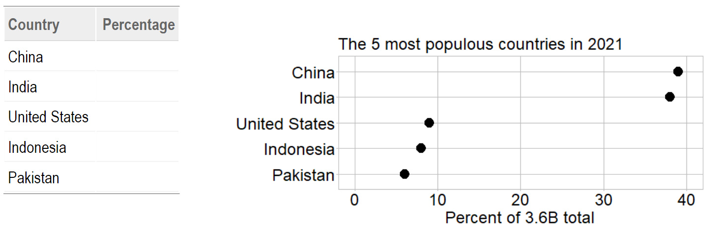
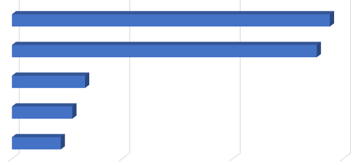
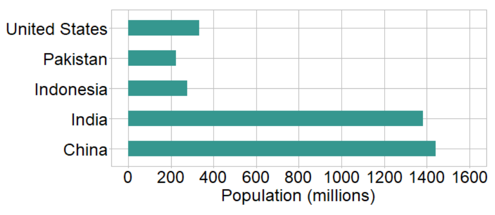
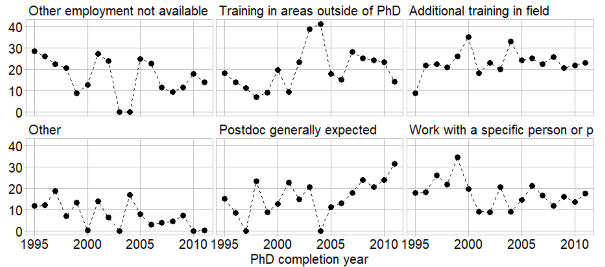

```{r setup, include=FALSE}
knitr::opts_chunk$set(echo=FALSE, warning=FALSE, message=FALSE)
knitr::opts_knit$set(root.dir = "../")

library(data.table)
library(ggplot2)
library(knitr)
library(graphclassmate)
library(magick)
library(docxtools)

library(tufte)
library(tufterhandout)
# invalidate cache when the tufte version changes
knitr::opts_chunk$set(cache.extra = packageVersion('tufte'))
options(htmltools.dir.version = FALSE)
```


```{marginfigure, echo=TRUE}
_Creating More Effective Graphs_ by Naomi Robbins (2013) inspired the session title and Chapter 2, "Limitations of some common graphs," inspired our exercises.
```


{width="75%"}

```{r fig.height = 0.1}
put_gap()
```


# `r "\U00A7"` Effective alternatives to pie charts


## Judging pie slices is a low-accuracy task

```{r fig.height = 0.3}
put_gap()
```

{width="150%"}    

```{r fig.height = 0.3}
put_gap()
```

```{marginfigure, echo=TRUE}
Data source: World Bank (2022)
```


## Judging values along a common axis is a high-accuracy task

```{marginfigure, echo = TRUE}
{width="50%"}    
```
`r margin_note("The data from the pie chart is shown below as dots along a common scale.")`

- The new chart displays the same data 

- *Visually estimate* the percentages using the new chart

- Fill-in the blanks in the table

```{r fig.height = 0.3}
put_gap()
```

{width="150%"}

```{r fig.height = 1}
put_gap()
```


## 3D effects distort our judgment even further

```{r fig.height = 0.3}
put_gap()
```

{width="150%"}    

```{r fig.height = 0.3}
put_gap()
```

```{marginfigure, echo=TRUE}
Data source: World Bank (2022)
```


## Again, a common scale improves our visual judgments

```{marginfigure, echo = TRUE}
{width="50%"}    
```
`r margin_note("The data from the pie chart is shown below as dots along a common scale.")`

- The new chart displays the same data 

- *Visually estimate* the percentages using the new chart

- Fill-in the blanks in the table

```{r fig.height = 0.2}
put_gap()
```

{width="150%"}

```{r fig.height = 0.6}
put_gap()
```


# `r "\U00A7"` Effective alternatives to bar charts 


## 3D effects always distort our judgment

```{r fig.height = 0.2}
put_gap()
```

{width="150%"}

```{r fig.height = 0.3}
put_gap()
```

```{marginfigure, echo=TRUE}
Data source: World Bank (2022)
```


## Same data---without 3D effects---along a common scale

```{marginfigure, echo = TRUE}
{width="50%"}    
```
`r margin_note("The data from the 3D bar chart is shown below as dots along a common scale.")`

- The new chart displays the same data

- Visually estimate the percentages using the new chart

- Fill-in the blanks in the table

{width="150%"}

```{r fig.height = 1}
put_gap()
```


## With a zero baseline and no 3D effects, bars are OK

- Zero baseline avoids deception

- Ordered by data values

- Only the endpoint encodes information

## Consider dot charts for

- Visually comparing quantities 

- Replacing most pie and bar charts 

```{marginfigure, echo = TRUE}
Default bar chart:

Ordered by magnitude:

Omitting the fill color:

Produces a dot chart:

```


## Notes
````{r fig.height = 1}
put_gap()
```


# `r "\U00A7"` Aligning the design to the story

## Visual grammar: charts encode information

Survey: “What was your reason for taking this postdoc?”


````{r fig.height = 0.2}
put_gap()
```

{width="150%"}

```{marginfigure, echo=TRUE}
Data adapted from Main, Wang, and Tan (2021)
```


## What information is encoded? 

Before discussing what the chart *means*, we first have to agree on what the information *is*. 

- Select one color. 

- What *information* does the color encode? 

- Write your thoughts below.

````{r fig.height = 3}
put_gap()
```


## Visual rhetoric: charts convey meaning  

Survey: “What was your reason for taking this postdoc?”

````{r fig.height = 0.2}
put_gap()
```

{width="150%"}


## What story do these data tell?

We agree on what the information *is*; now we consider what it *means.*

- *Meaning.* Describe a story (if any) this chart conveys *to you*.

- Write your thoughts below. 


````{r fig.height = 3.5}
put_gap()
```


# Visual grammar and rhetoric depend on the variables

{width="140%"}

````{r fig.height = 0.5}
put_gap()
```


# What can we say about these variables?  

````{r fig.height = 0.2}
put_gap()
```

{width="150%"}

````{r fig.height = 0.2}
put_gap()
```

`r newthought("Fill in the blanks")` to begin summarizing the data structure.  

1. ______PhD completion year________ is a *categorical* variable.`r margin_note("Note that discrete time units are not 'continuous', so the time units here are an ordered, categorical (not quantitative) variable.")`

2. _________________________________ is a *categorical* variable

3. _________________________________ is the *quantitative* variable 

4. _________________________________ is the *independent* variable


# Time series? Use a line chart.

Un-clutter the display using one panel per reason.

````{r fig.height = 0.1}
put_gap()
```

{width="125%"}

- *Meaning.* Describe a story (if any) this chart conveys *to you*.

- Write your thoughts below. 


````{r fig.height = 2.3}
put_gap()
```


# An unstated assumption underlies the visual muddle

- Emphasizing the trivial

- A distributed quantity is displayed in a box-and-whisker plot.

````{r fig.height = 0.2}
put_gap()
```

{width="75%"}


# Distributions? Use a box-and-whisker plot. 

{width="130%"}

````{r fig.height = 0.2}
put_gap()
```

- *Meaning.* Describe a story (if any) this chart conveys *to you*.

- Write your thoughts below. 

````{r fig.height = 4.5}
put_gap()
```


# Reflect on perception, reasoning, and credibility

````{r fig.height = 0.2}
put_gap()
```

{width="130%"}  

````{r fig.height = 0.2}
put_gap()
```

`r newthought("")`*Select any prompt.* Compare the stacked bar design to the box-and-whisker chart. Outline your response:

````{r fig.height = 0.2}
put_gap()
```

- Compare designs: Quantitative data are *perceived* accurately.  

````{r fig.height = 1.5}
put_gap()
```

- Compare designs: *Reasoning* about the data is supported effectively. 

````{r fig.height = 1.5}
put_gap()
```

- Compare designs: An argument is given *credible* visual support. 

````{r fig.height = 0.8}
put_gap()
```


# `r "\U00A7"` Advice from experts

Match the expert to the advice. 

`r newthought("Fill in the blanks")` with letters A--D. 

```{r}
x <- wrapr::build_frame(
  "Expert", "Letter", "Emphasizes the importance of"|
  " ", " ", " "|
  "A. Alberto Cairo"      , "______" , "message"|
  " ", " ", " "|
    
  "B. Jean-luc Doumont"   , "______" , "variables"|
  " ", " ", " "|
    
  "C. Stephanie Evergreen", "______" , "revealing the complex"|
    " ", " ", " "|
    
  "D. Edward Tufte"       , "______" , "knowing your main point"|
  " ", " ", " "|
    
  " "                     , "______" , "not lying to yourself"|
    
  " ", " ", " ")

knitr::kable(x)
```

````{r fig.height = 0.3}
put_gap()
```


# Ideas to consider

- Characterize the data structure and content

````{r fig.height = 0.2}
put_gap()
```

- Explore a story's context, causality, and complexity

````{r fig.height = 0.2}
put_gap()
```

- Align visual and verbal logic by revising iteratively

````{r fig.height = 0.2}
put_gap()
```

- Edit to suit the rhetorical goals for each audience

````{r fig.height = 0.2}
put_gap()
```

- Control every pixel---avoid thoughtless conformity

````{r fig.height = 0.2}
put_gap()
```

- Question are you seeing only what you want to believe?


# References


