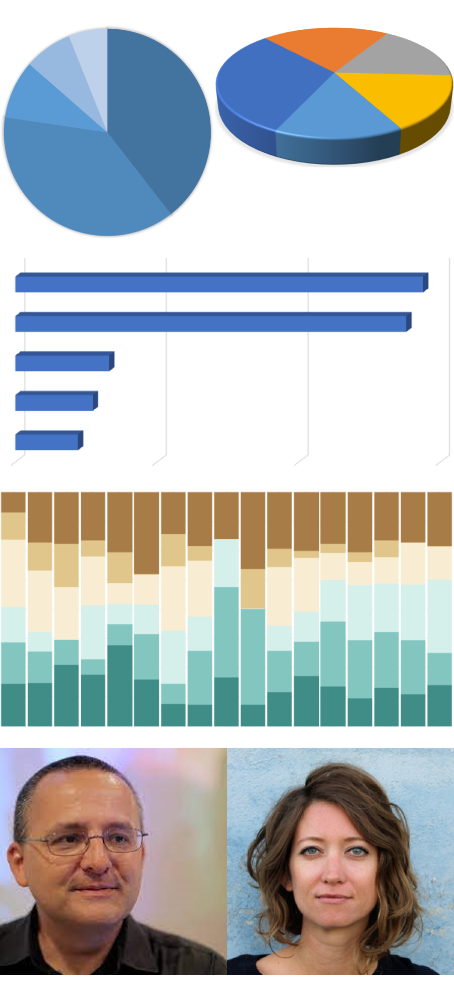
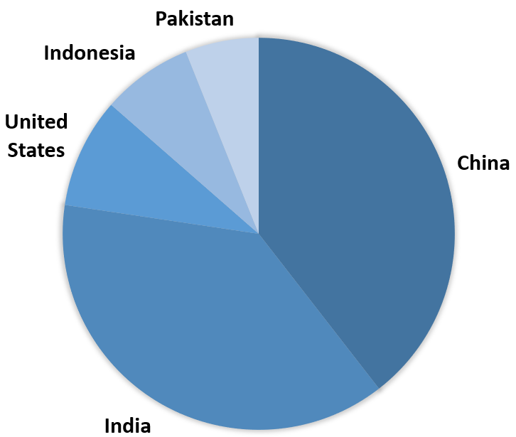
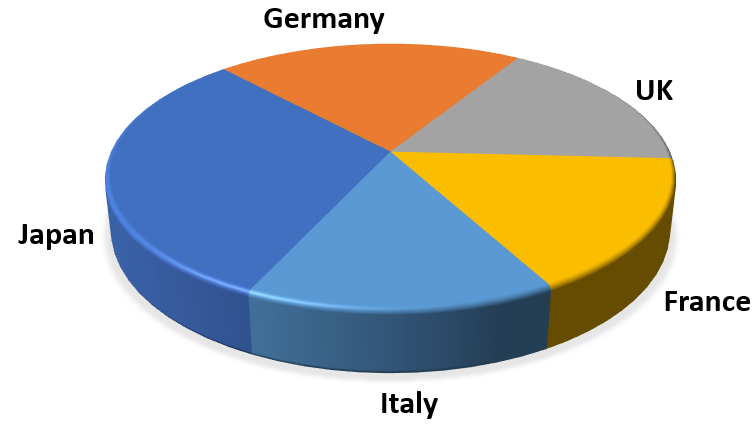
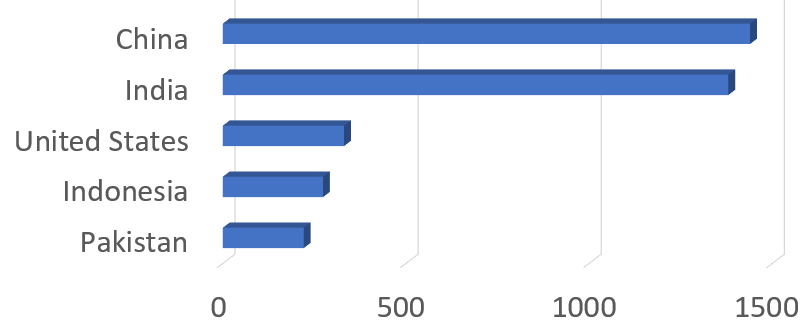
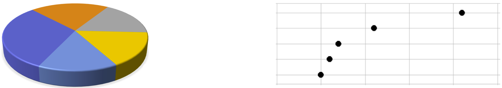
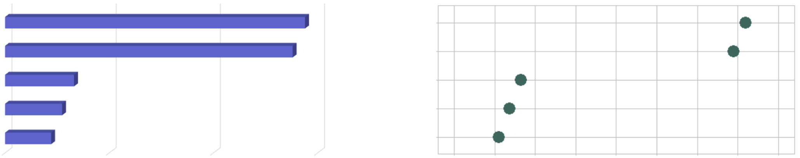
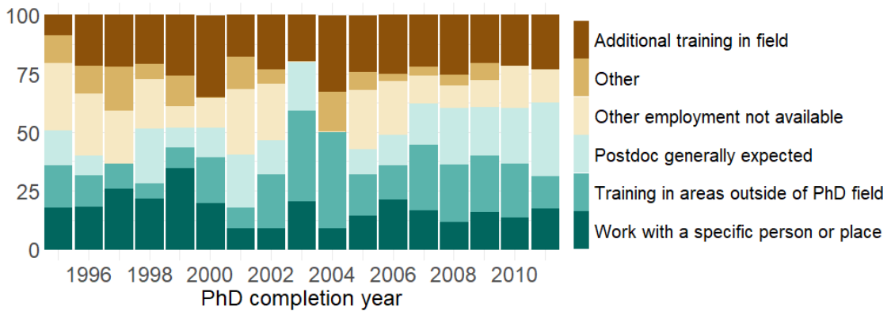
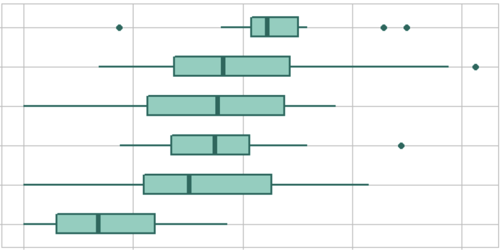

---
output:
  xaringan::moon_reader:
    css: ["default", "middlebury", "middlebury-fonts", "custom.css"]
    lib_dir: libs
    seal: false
    nature:
      highlightStyle: github
      highlightLines: true
      countIncrementalSlides: false
      slideNumberFormat: "%current%"
      ratio: 16:9
---

```{r setup, include=FALSE}
options(htmltools.dir.version = FALSE)
options(htmltools.dir.version = FALSE)
knitr::opts_chunk$set(echo=FALSE, warning=FALSE, message=FALSE)
knitr::opts_knit$set(root.dir = "../")

library(data.table)
library(ggplot2)
library(knitr)
library(kableExtra)
library(graphclassmate)
library(magick)

options(
  datatable.print.nrows = 16,
  datatable.print.topn = 6,
  datatable.print.class = TRUE
)
```

class: right

```{r}
# construct cover page images 
a <- image_read("slides/img/pie-preview.png")
g <- image_read("slides/img/three-d-pie-preview.png")
b <- image_read("slides/img/three-d-bar-preview.png")
c <- image_read("slides/img/stacked-bar-03.png")
c <- image_colorize(c,  opacity = 25, color = "white")
d <- image_read("slides/img/cairo-face.png")
e <- image_read("slides/img/evergreen-face.png")

std_width  <- "900"
half_width <- "450"
a <- image_scale(a, "x600")
g <- image_scale(g, "x400")
a <- image_append(c(a, g), stack = FALSE)
a <- image_scale(a, std_width)

b <- image_scale(b, std_width)
c <- image_scale(c, std_width)

d <- image_scale(d, half_width)
e <- image_scale(e, half_width)
d <- image_append(c(d,e), stack = FALSE)

border_dim <- "0x20"
a <- image_border(a, "white", border_dim)
b <- image_border(b, "white", border_dim)
c <- image_border(c, "white", border_dim)
d <- image_border(d, "white", border_dim)

z <- image_append(c(a, b), stack = TRUE)
z <- image_append(c(z, c), stack = TRUE)
z <- image_append(c(z, d), stack = TRUE)
z <- image_border(z, "white", "0x30")

image_write(z, 
        path = "slides/img/day1-cover-preview.png", 
        format = "png")

# version 2
p <- image_read("slides/img/pie-preview.png")
p <- image_scale(p, "x600")
q <- image_read("slides/img/three-d-bar-preview.png")
q <- image_scale(q, "x600")
r <- image_append(c(p, q), stack = FALSE)
r <- image_scale(r, std_width)
r <- image_border(r, "white", border_dim)
s <- image_append(c(r, c), stack = TRUE)
s <- image_append(c(s, d), stack = TRUE)
s <- image_border(s, "white", "0x30")
```

.left-column[

]

# Creating more effective charts

## Perception, reasoning, and credibility


<br>

<br>

2022 MIDFIELD Institute

Richard Layton   

<br>

<br>

<https://www.graphdoctor.com>

<https://github.com/graphdr>

<a href="mailto:graphdoctor@gmail.com">graphdoctor@gmail.com</a>


<div class="my-footer">
<span>
Title and exercises inspired by Naomi Robbins (2013) <em>Creating More Effective Graphs</em>, Chapter 2, Chart House.
</span>
</div>


---
class: left

.left-column[

]
<br>
#### $\quad$ Effective alternatives to pie charts

#### $\quad$

<br>

#### $\quad$ Effective alternatives to bar charts

#### $\quad$

<br>

#### $\quad$ Aligning the design to the story

#### $\quad$

<br>

#### $\quad$ Advice from experts


---
class:inverse, center, middle

# Effective alternatives to pie charts


---
class: left

# Judging pie slices is a low-accuracy task

```{r echo = FALSE}
country <- c("China", "India", "United States", "Indonesia", "Pakistan")
pop <- c(1439323776, 1380004385, 331002651, 273523615, 220892340)
dt1 <- data.table(country, pop)
dt1[, tot := sum(pop)]
dt1[, pct := round(100 * pop / tot, 0)]
```

.pull-left[

]

.pull-right[
- *Visually estimate* each country's percentage

- Fill-in the blanks in the table

- Total should be 100%

```{r echo = FALSE}
top5 <- copy(dt1)
top5 <- top5[, .(country, pct)]
top5 %>%
  kbl(col.names = c("Country", "Percentage"), align = "lr") %>%
  kable_paper(lightable_options = "basic", 
              full_width = TRUE, 
              font_size = 24) %>%
  column_spec(2, color = "white", background = "white") %>%
  column_spec(1, color = "black", background = "white")
```
]

<div class="my-footer">
<span>
Data source:  
<a href="https://worldpopulationreview.com/">
2021 World population review</a> (The pie represents 3.6B people total.)
</span>
</div> 


---
class: left

# Judging values along a common axis is a high-accuracy task

- The new chart displays the same data 

- *Visually estimate* the percentages using the new chart

- Fill-in the blanks in the table

.right-column[
```{r echo=FALSE, fig.asp=0.4, fig.width = 10}
ggplot(dt1, aes(x = pct, y = reorder(country, pct))) +
  geom_point(size = 6) + 
  labs(x = "Percent of 3.6B total", 
       y = "", 
       title = "The 5 most populous countries in 2021") + 
  theme_graphclass(font_size = 24) +
  scale_x_continuous(limits = c(0, 40))
```
]

.left-column[
```{r echo=FALSE}
top5 %>%
  kbl(col.names = c("Country", "Percentage"), align = "lr") %>%
  kable_paper(lightable_options = "basic", 
              full_width = TRUE, 
              font_size = 24) %>%
  column_spec(2, color = "white", background = "white") %>%
  column_spec(1, color = "black", background = "white")
```
]

<div class="my-footer">
<span>
Data source:  
<a href="https://worldpopulationreview.com/">
2021 World population review</a>
</span>
</div> 


---
class: left

# Judging values along a common axis is a high-accuracy task

Compare your visual estimates to the data values.

<br>

<br>

.right-column[
```{r echo=FALSE, fig.asp=0.4, fig.width = 10}
ggplot(dt1, aes(x = pct, y = reorder(country, pct))) +
  geom_point(size = 6) + 
  labs(x = "Percent of 3.6B total", 
       y = "", 
       title = "The 5 most populous countries in 2021") + 
  theme_graphclass(font_size = 24) +
  scale_x_continuous(limits = c(0, 40))
```
]

.left-column[
```{r echo=FALSE}
top5 %>%
  kbl(col.names = c("Country", "Percentage"), align = "lr") %>%
  kable_paper(lightable_options = "basic", 
              full_width = TRUE, 
              font_size = 24) %>%
  column_spec(2, color = "black", background = "white") %>%
  column_spec(1, color = "black", background = "white")
```
]

<div class="my-footer">
<span>
Data source:  
<a href="https://worldpopulationreview.com/">
2021 World population review</a>
</span>
</div>


---
class: left

# 3D effects distort our judgment even further

```{r echo = FALSE}
country <- c("Japan", "Germany", "UK", "France", "Italy")
pop <- c(125.8, 84, 68.4, 65.5, 60.3)
dt2 <- data.table(country, pop)
dt2[, tot := sum(pop)]
dt2[, pct := round(100 * pop / tot, 0)]
```

.pull-left[

]

.pull-right[- *Visually estimate* each country's percentage

- Fill-in the blanks in the table

- Total should be 100%

```{r echo = FALSE}
y <- copy(dt2)
y <- y[, .(country, pct)]

y %>%
  kbl(col.names = c("Country", "Percentage"), align = "lr") %>%
  kable_paper(lightable_options = "basic", 
              full_width = TRUE, 
              font_size = 24) %>%
  column_spec(2, color = "white", background = "white") %>%
  column_spec(1, color = "black", background = "white")
```
]

<div class="my-footer">
<span>
Data source:  
<a href="https://worldpopulationreview.com/">
2021 World population review</a> (The pie represents 404M people.)
</span>
</div>


---
class: left

# Again, a common scale improves our visual judgments

- The new chart displays the same data 

- *Visually estimate* the percentages using the new chart

- Fill-in the blanks in the table 

.right-column[

```{r echo=FALSE, fig.asp=0.4, fig.width = 10}
ggplot(dt2, aes(x = pct, y = reorder(country, pct))) +
  geom_point(size = 6) + 
  labs(x = "Percent of 404M total", 
       y = "", 
       title = "Population of selected countries in 2021") + 
  theme_graphclass(font_size = 24) +
  scale_x_continuous(limits = c(10, 35), breaks = seq(0, 100, 5))
```

]

.left-column[
```{r echo=FALSE}
y %>%
  kbl(col.names = c("Country", "Percentage"), align = "lr") %>%
  kable_paper(lightable_options = "basic", 
              full_width = TRUE, 
              font_size = 24) %>%
  column_spec(2, color = "white", background = "white") %>%
  column_spec(1, color = "black", background = "white")
```
]

<div class="my-footer">
<span>
Data source:  
<a href="https://worldpopulationreview.com/">
2021 World population review</a>
</span>
</div>


---
class: left

# Again, a common scale improves our visual judgments

Compare your visual estimates to the data values.

<br>

<br>
.right-column[
```{r echo=FALSE, fig.asp=0.4, fig.width = 10}
ggplot(dt2, aes(x = pct, y = reorder(country, pct))) +
  geom_point(size = 6) + 
  labs(x = "Percent of 404M total", 
       y = "", 
       title = "Population of selected countries in 2021") + 
  theme_graphclass(font_size = 24) +
  scale_x_continuous(limits = c(10, 35), breaks = seq(0, 100, 5))
```
]

.left-column[
```{r echo=FALSE}
y %>%
  kbl(col.names = c("Country", "Percentage"), align = "lr") %>%
  kable_paper(lightable_options = "basic", 
              full_width = TRUE, 
              font_size = 24) %>%
  column_spec(2, color = "black", background = "white") %>%
  column_spec(1, color = "black", background = "white")
```
]

<div class="my-footer">
<span>
Data source:  
<a href="https://worldpopulationreview.com/">
2021 World population review</a>
</span>
</div>


---
class:inverse, center, middle

# Effective alternatives to bar charts


---
class: left

# 3D effects always distort our judgment

- *Visually estimate* each country's population in millions

- Fill-in the blanks in the table

.left-column[
```{r echo = FALSE}
top5 %>%
  kbl(col.names = c("Country", "Millions"), align = "lr") %>%
  kable_paper(lightable_options = "basic", 
              full_width = TRUE, 
              font_size = 24) %>%
  column_spec(2, color = "white", background = "white") %>%
  column_spec(1, color = "black", background = "white")
```
]

.right-column[

.center[2021 population (in millions)]
]

<div class="my-footer">
<span>
Data source:  
<a href="https://worldpopulationreview.com/">
2021 World population review</a>
</span>
</div>


---
class: left

# Same data&mdash;without 3D effects&mdash;along a common scale

- The new chart displays the same data 

- *Visually estimate* the percentages using the new chart

- Fill-in the blanks in the table 

.left-column[
```{r echo = FALSE}
x <- copy(dt1)
x <- x[, .(country, pop)]
x$pop <- round(x$pop / 1e6, 0)

x %>%
  kbl(col.names = c("Country", "Millions"), align = "lr") %>%
  kable_paper(lightable_options = "basic", 
              full_width = TRUE, 
              font_size = 24) %>%
  column_spec(2, color = "white", background = "white") %>%
  column_spec(1, color = "black", background = "white")
```
]

.right-column[
```{r echo=FALSE, fig.asp=0.4, fig.width = 10}
f <- ggplot(dt1, aes(x = pop/1e6, y = reorder(country, pop))) +
  geom_point(size = 6) + 
  labs(x = "Population (millions)", 
       y = "", 
       title = "The 5 most populous countries in 2021") + 
  theme_graphclass(font_size = 24) +
  scale_x_continuous(limits = c(200, 1500), breaks = seq(0, 1600, 200))
f
```
]

<div class="my-footer">
<span>
Data source:  
<a href="https://worldpopulationreview.com/">
2021 World population review</a>
</span>
</div>


---
class: left

# Same data&mdash;without 3D effects&mdash;along a common scale

Compare your visual estimates to the data values.

<br>

<br>

.left-column[
```{r echo = FALSE}
x %>%
  kbl(col.names = c("Country", "Millions"), align = "lr") %>%
  kable_paper(lightable_options = "basic", 
              full_width = TRUE, 
              font_size = 24) %>%
  column_spec(2, color = "black", background = "white") %>%
  column_spec(1, color = "black", background = "white")
```
]

.right-column[
```{r echo=FALSE, fig.asp=0.4, fig.width = 10}
f
```
]

<div class="my-footer">
<span>
Data source:  
<a href="https://worldpopulationreview.com/">
2021 World population review</a>
</span>
</div>


---
class: left

# With a zero baseline and no 3D effects, bars are OK

Bar charts must have a zero baseline to avoid deceiving your audience. 

<br>

```{r echo=FALSE, fig.asp=0.4, fig.width = 10}
f <- ggplot(x, aes(x = pop, y = country)) +
  geom_bar(stat = "identity", 
           width = 0.5, 
           color = rcb("mid_BG"), 
           fill = rcb("mid_BG")) +
  labs(x = "Population (millions)", 
       y = "") +
  theme_graphclass(font_size = 24) +
  scale_x_continuous(breaks = seq(0, 1600, 200), limits = c(0, 1600))
f
```

<div class="my-footer">
<span>
Data source:  
<a href="https://worldpopulationreview.com/">
2021 World population review</a>
</span>
</div>


---
class: left

# Row order affects the audience's ability to make comparisons

Ordering rows by the data values is usually superior to alphabetical order for visual comparisons.  

<br>

```{r echo=FALSE, fig.asp=0.4, fig.width = 10}
f <- f +
  aes(x = pop, y = reorder(country, pop)) +
  labs(x = "Population (millions)", 
       y = "") 
f
```

<div class="my-footer">
<span>
Data source:  
<a href="https://worldpopulationreview.com/">
2021 World population review</a>
</span>
</div>


---
class: left

# Area is perceived differently than position

Area encodes no information. The only information in the bar is the position of its end point.

<br>

```{r echo=FALSE, fig.asp=0.4, fig.width = 10}
f <- ggplot(x, aes(x = pop, y = reorder(country, pop))) +
  geom_bar(stat = "identity", 
           width = 0.5, 
           color = rcb("mid_BG"), 
           fill = "transparent") +
  geom_point(size = 8, color = rcb("dark_BG")) +
  labs(x = "Population (millions)", 
       y = "") +
  theme_graphclass(font_size = 24) +
  scale_x_continuous(breaks = seq(0, 1600, 200), limits = c(0, 1600))
f
```

<div class="my-footer">
<span>
Data source:  
<a href="https://worldpopulationreview.com/">
2021 World population review</a>
</span>
</div>


 
 
 
 
 
 
 

---
class: left

# Dot charts allow direct visual comparison of quantities 

The result is the *dot chart* (Cleveland 1993). 

<br>

```{r echo=FALSE, fig.asp=0.4, fig.width=10}
f <- ggplot(x, aes(x = pop, y = reorder(country, pop))) +
  geom_point(size = 8, color = rcb("dark_BG")) +
  labs(x = "Population (millions)", 
       y = "") +
  theme_graphclass(font_size = 24) +
  scale_x_continuous(breaks = seq(0, 1600, 200), limits = c(0, 1600))
f
```


<div class="my-footer">
<span>
William S. Cleveland (1993) <em>Visualizing Data</em> Hobart Press, Summit, NJ. 
</span>
</div>


---
class: left

# Dot charts are effective replacements for pies and bars 






---
class:inverse, center, middle

# Aligning the design to the story


---
class: left

# Visual grammar: charts encode information


Surveys: “What was your reason for taking this postdoc?”




```{r echo = FALSE}
dt <- fread("data/fig2.csv")
dt[reason %chin% "Postdoc generally expected for career in this field", 
   reason := "Postdoc generally expected"]
dt[reason %chin% "Additional training in PhD field", 
   reason := "Additional training in field"]
```

```{r echo=FALSE, fig.asp=0.35, fig.width=14}
p <- ggplot(dt, aes(x = year, y = pct, color = reason, fill = reason)) +
  geom_bar(stat = "identity") + 
  scale_color_brewer(palette="BrBG") + 
  scale_fill_brewer(palette="BrBG") +
  scale_x_continuous(breaks = seq(1996, 2010, 2), expand = c(0, 0)) +
  theme_minimal() +
  labs(y = "", x = "PhD completion year") +
  theme(axis.text    = element_text(size = 24), 
        axis.title.x = element_text(size = 24), 
        legend.text  = element_text(size = 20), 
        legend.title = element_blank(), 
        legend.key.height = unit(15, "mm"))
```


Decode the *information* before discussing *meaning.* 

Select one color. What *information* does the color encode? 


<div class="my-footer">
<span>
Data source: Main, Joyce B., Yanbing Wang, and Li Tan (2021) “The career outlook of engineering PhDs” <em>J of Engineering Education</em> 110 (4): 977–1002.  
</span>
</div> 


---
class: left

# Visual rhetoric: charts convey meaning

Surveys: “What was your reason for taking this postdoc?”


Agreeing on what the information *is*, we can consider what it *means*. 

*Meaning.* Describe a story (if any) this chart *conveys to you.*


<div class="my-footer">
<span>
Data source: Main, Joyce B., Yanbing Wang, and Li Tan (2021) “The career outlook of engineering PhDs” <em>J of Engineering Education</em> 110 (4): 977–1002.  
</span>
</div> 


---
class: left

# Visual grammar and visual rhetoric depend on the variables 

.pull-left[

]


.pull-right[
<br>

- What is your question?

- What variables are measured?

- How are the variables classified?

- What chart designs suit these variables?

- What stories do the charts convey? 

- How do the stories refine your questions? 

- What new variables are needed? 

- Repeat
]


---
class: left

# What can we say about these variables?  

Surveys: “What was your reason for taking this postdoc?”


1. `______PhD completion year___________` is a *categorical* variable.

2. `____________________________________` is a *categorical* variable

3. `____________________________________` is the *quantitative* variable 

4. `____________________________________` is the *independent* variable


---
class: left

# What can we say about these variables?  

Surveys: “What was your reason for taking this postdoc?”


1. `______PhD completion year___________` is a *categorical* variable.

2. `______Postdoc reasons_______________` is a *categorical* variable

3. `______Percent citing a reason_______` is the *quantitative* variable (one observation per reason per year)

4. `______PhD completion year___________` is the *independent* variable


---
class: left

# Time series? Use a line chart. 

The original chart implies the data are a time series.  

```{r echo=FALSE, fig.asp=0.4, fig.width=16} 
ggplot(dt, aes(x = year, y = pct, color = reason)) +
  geom_line(linetype = 2) +
  geom_point(size = 4) +
  labs(y = "Reason cited (%)", x = "PhD completion year") +
  theme_graphclass(font_size = 20) +
  scale_color_brewer(palette = "Dark2")
```


---
class: left

# Time series? Use a line chart. 

Un-clutter the display using one panel per reason

```{r echo=FALSE, fig.asp=0.4, fig.width=13}
ggplot(dt, aes(x = year, y = pct)) +
  geom_line(linetype = 2) +
  geom_point(size = 4) +
  facet_wrap(vars(reorder(reason, pct, median)), as.table = FALSE) +
  labs(y = "Reason cited (%)", x = "PhD completion year") +
  theme_graphclass(font_size = 20)

```


*Meaning.* Describe a story (if any) this chart *conveys to you.*


---
class: left

# An unstated assumption underlies the visual muddle

*Emphasizing the trivial* (Howard Wainer)

- Poor choice of independent variable

- Imposes a visual convention 


<div class="my-footer">
<span>
Howard Wainer (1997) <em>Visual Revelations</em>, Lawrence Erlbaum Assoc., Mahwah, NJ, p. 30.  
</span>
</div>


--

<br>
Ignore time, the remaining variables are:

- percent citing a reason (quantitative) distributed

- reasons (categorical, 6 levels) 


--
<br>
A distributed quantity is displayed in a box-and-whisker plot

.center[
```{r echo=FALSE, fig.asp=0.15, fig.width=10}
z <- copy(dt)
z <- z[reason == "Work with a specific person or place"]
ggplot(z, aes(x = pct, y = reason)) +
  geom_boxplot(width = 0.5, 
               outlier.size = 3, 
               size = 1, 
               fill = "white", 
               color = rcb("dark_BG")) +
  scale_x_continuous(limits = c(0, 40)) +
  theme_void() +
  annotate("text", 
           size = 6, 
           x = c(7.5, 17.5, 27.5, 32.5), 
           y = c(1.03, 1.4, 1.03, 1.03), 
           label = c("min", "median", "max", "outlier")
           ) +
    annotate("text", 
           size = 6, 
           x = c(11, 24, 15.5, 19), 
           y = c(0.9, 0.9, 0.65, 0.65), 
           label = "25%"
           ) +
  theme(text = element_text(size = 20))
```
]


---
class: left

# Distributions? Use a box-and-whisker plot.  

Surveys: “What was your reason for taking this postdoc?”

```{r echo=FALSE, fig.asp=0.35, fig.width=13}
ggplot(dt, aes(x = pct, y = reorder(reason, pct, median))) +
  geom_boxplot(width = 0.5, 
               outlier.size = 3, 
               size = 1, 
               fill = rcb("light_BG"), 
               color = rcb("dark_BG")) +
  labs(y = "", x = "Percent selecting a reason (1995-2011)") +
  theme_graphclass(font_size = 22)

```

<br>

*Meaning.* Describe a story this chart *conveys to you.*


---
class: left

# Reflect on perception, reasoning, and credibility

.left-column[
Compare the stacked bar


to the boxplot design. 


]

.right-column[
*Select any prompt.* Outline your response:  

<br>

- Compare designs: Quantitative data are *perceived* accurately.  

<br>

- Compare designs: *Reasoning* about the data is supported effectively. 

<br>

- Compare designs: An argument is given *credible* visual support. 
]


---
class:inverse, center, middle

# Advice from experts


---
class: left

# Jean-Luc Doumont

.left-column[

]
.right-column[
The optimal graph design depends on two factors, primarily, 

1. The message to be conveyed

2. The variables to be shown
]


<div style="text-align: right;">

</div>


<div class="my-footer">
<span>
Jean-luc Doumont (2009) <em>Trees, Maps and Theorems</em>, Principiae. 
</span>
</div> 


---
class: left

# Edward Tufte

.left-column[

]
.right-column[
The task of the designer is to give visual access 

to the subtle and the difficult&mdash;that is, 

the revelation of the complex.
]


<div style="text-align: right;">

</div>


<div class="my-footer">
<span>
Edward Tufte (1983) <em>The Visual Display of Quantitative Information</em>, Graphics Press. 
</span>
</div> 


---
class: left

# Stephanie Evergreen

.left-column[

]
.right-column[

<br>

What’s your point? 

Seriously, that’s the most important question. 
]

<div style="text-align: right;">

</div>


<div class="my-footer">
<span>
Stephanie D. H. Evergreen (2017) <em>Effective Data Visualization</em>, Sage. 
</span>
</div> 


---
class: left

# Alberto Cairo

.left-column[

]
.right-column[
Charts can lie to to us because we read too much into

them or see in them what we want to believe. 

Don't lie to yourself (or others) with charts. 
]

<div style="text-align: right;">

</div>


<div class="my-footer">
<span>
Alberto Cairo (2019) <em>How Charts Lie</em>, W.W. Norton 
</span>
</div>


---
class: left

# Ideas to consider


- **Characterize** the data structure and content 

- **Explore** a story's context, causality, and complexity

- **Align** visual and verbal logic by revising iteratively 

- **Edit** to suit the rhetorical goals for each audience  

- **Control** every pixel&mdash;avoid thoughtless conformity

- **Question** are you seeing only what you want to believe?


---
class:inverse, center, middle
