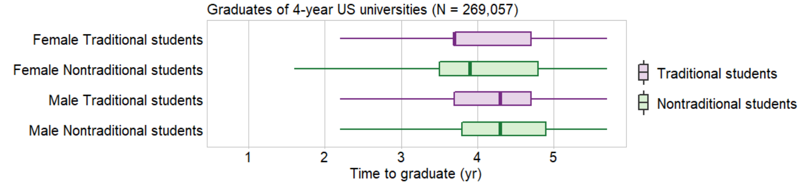

```{r setup, include=FALSE}
knitr::opts_chunk$set(echo=FALSE, warning=FALSE, message=FALSE)
knitr::opts_knit$set(root.dir = "../")

library(data.table)
library(ggplot2)
library(knitr)
library(graphclassmate)
library(magick)
library(docxtools)

library(tufte)
library(tufterhandout)
# invalidate cache when the tufte version changes
knitr::opts_chunk$set(cache.extra = packageVersion('tufte'))
options(htmltools.dir.version = FALSE)
```

# Expanding your graphical repertoire: Four main topics

`r margin_note("I suggest you have a printed copy of this handout to write in during the workshop. We have a number of think-write-share activities that for many people work best when thoughts are written down.")`

{width="75%"}

```{r fig.height = 0.1}
put_gap()
```

# Notes 

```{r fig.height = 2}
put_gap()
```


# `r "\U00A7"` Comparing data


## Dot plot

```{marginfigure, echo = TRUE}
$\quad$
  
$\quad$
  
$\quad$
  
$\quad$
  
$\quad$
  
$\quad$
    
$\quad$
  
*Variables + Argument &#x2192; Design*
  
$\quad$

*Variables*: (1) quamtity, (1) category
  
$\quad$
  
*Argument*: Comparison
```
{width="80%"}

- Describe the main idea(s) this chart conveys to you.

```{r fig.height = 2}
put_gap()
```

- What questions does the chart raise?

```{r fig.height = 2}
put_gap()
```


## Multiway dot chart, superposed

{width="160%"}

- Describe the main idea(s) this chart conveys to you.

```{marginfigure, echo = TRUE}
$\quad$
  
$\quad$
  
*Variables + Argument &#x2192; Design*
  
$\quad$

*Variables*: (1) quamtity, (3) categories

$\quad$
  
*Argument*: Comparison
```

```{r fig.height = 2}
put_gap()
```

- What questions does the chart raise?

```{r fig.height = 2}
put_gap()
```


# `r "\U00A7"` Revealing correlations


## Scatterplot

```{marginfigure, echo = TRUE}
$\quad$

$\quad$

$\quad$

$\quad$

$\quad$

$\quad$

$\quad$

*Variables + Argument &#x2192; Design*

$\quad$

*Variables*: (2) quamtities

$\quad$

*Argument*: Correlation
```

{width="80%"}

- Describe the main idea(s) this chart conveys to you.

```{r fig.height = 2}
put_gap()
```

- What questions does the chart raise?

```{r fig.height = 1}
put_gap()
```


## Scatterplot, faceted

{width="160%"}

- Describe the main idea(s) this chart conveys to you.

```{marginfigure, echo = TRUE}
$\quad$
  
$\quad$
  
*Variables + Argument &#x2192; Design*
  
$\quad$

*Variables*: (2) quamtities, (1) category

$\quad$
  
*Argument*: Correlation & comparison
```

```{r fig.height = 2}
put_gap()
```

- What questions does the chart raise?

```{r fig.height = 2}
put_gap()
```


# `r "\U00A7"` Showing evolution


## Time series

```{marginfigure, echo = TRUE}
$\quad$
  
$\quad$
  
$\quad$
  
$\quad$
  
$\quad$
  
$\quad$

*Variables + Argument &#x2192; Design*
  
$\quad$

*Variables*: Discrete time, (1) quantity
  
$\quad$
  
*Argument*: Evolution
```
{width="80%"}

- Describe the main idea(s) this chart conveys to you.

```{r fig.height = 2}
put_gap()
```

- What questions does the chart raise?

```{r fig.height = 1}
put_gap()
```


## Time series, faceted

{width="160%"}

- Describe the main idea(s) this chart conveys to you.

```{marginfigure, echo = TRUE}
$\quad$

$\quad$

$\quad$

*Variables + Argument &#x2192; Design*

$\quad$

*Variables*: Discrete time,    
(1) quantity, (1) category

$\quad$

*Argument*: Evolution & comparison
```

```{r fig.height = 2}
put_gap()
```

- What questions does the chart raise?

```{r fig.height = 2}
put_gap()
```


## Connected scatterplot, faceted

{width="160%"}

- Describe the main idea(s) this chart conveys to you.

```{marginfigure, echo = TRUE}
$\quad$
  
$\quad$
  
$\quad$
  
*Variables + Argument &#x2192; Design*
  
$\quad$

*Variables*: Discrete time,    
(2) quantities, (1) category
  
$\quad$
  
*Argument*: Evolution, correlation,    
& comparison
```

```{r fig.height = 2}
put_gap()
```

- What questions does the chart raise?

```{r fig.height = 2}
put_gap()
```


## Cyclic time series, superposed

{width="160%"}

- Describe the main idea(s) this chart conveys to you.

```{marginfigure, echo = TRUE}
$\quad$
  
$\quad$
  
$\quad$
  
*Variables + Argument &#x2192; Design*
  
$\quad$

*Variables*: Discrete time,    
(1) quantity, (2) categories
  
$\quad$
  
*Argument*: Evolution & comparison
```

```{r fig.height = 2}
put_gap()
```

- What questions does the chart raise?

```{r fig.height = 2}
put_gap()
```


# `r "\U00A7"` Displaying distributions


## Strip chart, superposed

{width="160%"}

- Describe the main idea(s) this chart conveys to you.

```{marginfigure, echo = TRUE}
$\quad$
  
$\quad$
  
*Variables + Argument &#x2192; Design*
  
$\quad$

*Variables*: (1) quantity, (2) categories
  
$\quad$
  
*Argument*: Distribution & comparison
```

```{r fig.height = 2}
put_gap()
```

- What questions does the chart raise?

```{r fig.height = 2}
put_gap()
```


## Box and whisker chart

{width="160%"}

- Describe the main idea(s) this chart conveys to you.

```{marginfigure, echo = TRUE}
$\quad$
  
$\quad$
  
*Variables + Argument &#x2192; Design*
  
$\quad$

*Variables*: (1) quantity, (2) categories
  
$\quad$
  
*Argument*: Distribution & comparison
```

```{r fig.height = 2}
put_gap()
```

- What questions does the chart raise?

```{r fig.height = 2}
put_gap()
```


# References


