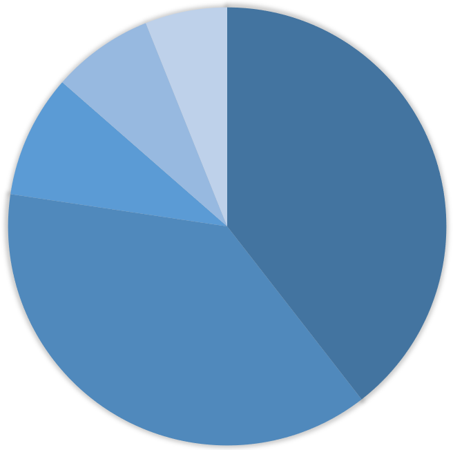
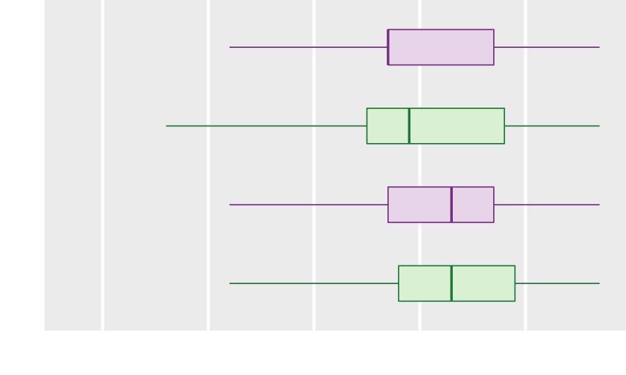

```{r setup, include=FALSE}
options(htmltools.dir.version = FALSE)

library(data.table)
library(ggplot2)
library(knitr)
library(kableExtra)
library(graphclassmate)
```

class: right

.left-column[



]

.right-column[
# Perception, reasoning, and credibility

## Limitations of common graph types

Richard Layton   

2022-02-14
]


---
class:inverse, center, middle

# Pie charts


---
class: left

# Judging angles is a low-accuracy task

```{r echo = FALSE}
country <- c("China", "India", "United States", "Indonesia", "Pakistan")
pop <- c(1439323776, 1380004385, 331002651, 273523615, 220892340)
dt1 <- data.table(country, pop)
dt1[, tot := sum(pop)]
dt1[, pct := round(100 * pop / tot, 0)]
```

.pull-left[

]

.pull-right[
Estimate the percentage of each pie slice
```{r echo = FALSE}
top5 <- copy(dt1)
top5 <- top5[, .(country, pct)]
top5 %>%
  kbl(col.names = c("Country", "Percentage"), align = "lr") %>%
  kable_paper(lightable_options = "basic", 
              full_width = TRUE, 
              font_size = 24) %>%
  column_spec(2, color = "white", background = "white") %>%
  column_spec(1, color = "black", background = "white")
```

The total should be 100&.
]

.footnote[2021 population data source: [2021 World population review](https://worldpopulationreview.com/)]


---
class: left

# Judging values along a common axis is a high-accuracy task

The same data is displayed along a common axis.  Make new visual estimates.

<br>

.right-column[
```{r echo=FALSE, fig.asp=0.4, fig.width = 10}
ggplot(dt1, aes(x = pct, y = reorder(country, pct))) +
  geom_point(size = 6) + 
  labs(x = "Percent of 3.6B total", 
       y = "", 
       title = "The 5 most populous countries in 2021") + 
  theme_graphclass(font_size = 24) +
  scale_x_continuous(limits = c(0, 40))
```
]

.left-column[
```{r echo=FALSE}
top5 %>%
  kbl(col.names = c("Country", "Percentage"), align = "lr") %>%
  kable_paper(lightable_options = "basic", 
              full_width = TRUE, 
              font_size = 24) %>%
  column_spec(2, color = "white", background = "white") %>%
  column_spec(1, color = "black", background = "white")
```
]


---
class: left

# Judging values along a common axis is a high-accuracy task

Compare your visual estimates to the data values.

<br>

.right-column[
```{r echo=FALSE, fig.asp=0.4, fig.width = 10}
ggplot(dt1, aes(x = pct, y = reorder(country, pct))) +
  geom_point(size = 6) + 
  labs(x = "Percent of 3.6B total", 
       y = "", 
       title = "The 5 most populous countries in 2021") + 
  theme_graphclass(font_size = 24) +
  scale_x_continuous(limits = c(0, 40))
```
]

.left-column[
```{r echo=FALSE}
top5 %>%
  kbl(col.names = c("Country", "Percentage"), align = "lr") %>%
  kable_paper(lightable_options = "basic", 
              full_width = TRUE, 
              font_size = 24) %>%
  column_spec(2, color = "black", background = "white") %>%
  column_spec(1, color = "black", background = "white")
```
]


---
class: left

# 3D effects distort our judgment even further

```{r echo = FALSE}
country <- c("Japan", "Germany", "UK", "France", "Italy")
pop <- c(125.8, 84, 68.4, 65.5, 60.3)
dt2 <- data.table(country, pop)
dt2[, tot := sum(pop)]
dt2[, pct := round(100 * pop / tot, 0)]
```

.pull-left[

]

.pull-right[
Estimate the percentage of each pie slice
```{r echo = FALSE}
y <- copy(dt2)
y <- y[, .(country, pct)]

y %>%
  kbl(col.names = c("Country", "Percentage"), align = "lr") %>%
  kable_paper(lightable_options = "basic", 
              full_width = TRUE, 
              font_size = 24) %>%
  column_spec(2, color = "white", background = "white") %>%
  column_spec(1, color = "black", background = "white")
```

The total should be 100%. 
]


---
class: left

# Again, a common scale improves our visual judgments

The same data is displayed along a common axis.  Make new visual estimates.

<br>

.right-column[

```{r echo=FALSE, fig.asp=0.4, fig.width = 10}
ggplot(dt2, aes(x = pct, y = reorder(country, pct))) +
  geom_point(size = 6) + 
  labs(x = "Percent of 404M total", 
       y = "", 
       title = "Population of selected countries in 2021") + 
  theme_graphclass(font_size = 24) +
  scale_x_continuous(limits = c(10, 35), breaks = seq(0, 100, 5))
```

]

.left-column[
```{r echo=FALSE}
y %>%
  kbl(col.names = c("Country", "Percentage"), align = "lr") %>%
  kable_paper(lightable_options = "basic", 
              full_width = TRUE, 
              font_size = 24) %>%
  column_spec(2, color = "white", background = "white") %>%
  column_spec(1, color = "black", background = "white")
```
]


---
class: left

# Again, a common scale improves our visual judgments

Compare your visual estimates to the data values.

<br>

.right-column[
```{r echo=FALSE, fig.asp=0.4, fig.width = 10}
ggplot(dt2, aes(x = pct, y = reorder(country, pct))) +
  geom_point(size = 6) + 
  labs(x = "Percent of 404M total", 
       y = "", 
       title = "Population of selected countries in 2021") + 
  theme_graphclass(font_size = 24) +
  scale_x_continuous(limits = c(10, 35), breaks = seq(0, 100, 5))
```
]

.left-column[
```{r echo=FALSE}
y %>%
  kbl(col.names = c("Country", "Percentage"), align = "lr") %>%
  kable_paper(lightable_options = "basic", 
              full_width = TRUE, 
              font_size = 24) %>%
  column_spec(2, color = "black", background = "white") %>%
  column_spec(1, color = "black", background = "white")
```
]


---
class: left

# Graph design should align with one's rhetorical goals

.pull-left[
In going from this design...


]

.pull-right[
...to this design... 


]

<br>

- we improve the accuracy of the audience's **perception** of the data 

- we make it easier to **reason** quantitatively about the data 

- which should enhance our **credibility** with the audience 


---
class:inverse, center, middle

# Bar charts


---
class: left

# 3D effects always distort our judgment

Make visual estimates of each country's 2021 population. 

<br>

.left-column[
```{r echo = FALSE}
top5 %>%
  kbl(col.names = c("Country", "Millions"), align = "lr") %>%
  kable_paper(lightable_options = "basic", 
              full_width = TRUE, 
              font_size = 24) %>%
  column_spec(2, color = "white", background = "white") %>%
  column_spec(1, color = "black", background = "white")
```
]

.right-column[

.center[2021 population (in millions)]
]


---
class: left

# Same data&mdash;without 3D effects&mdash;along a common scale

Make new visual estimates. 

<br>

.left-column[
```{r echo = FALSE}
x <- copy(dt1)
x <- x[, .(country, pop)]
x$pop <- round(x$pop / 1e6, 0)

x %>%
  kbl(col.names = c("Country", "Millions"), align = "lr") %>%
  kable_paper(lightable_options = "basic", 
              full_width = TRUE, 
              font_size = 24) %>%
  column_spec(2, color = "white", background = "white") %>%
  column_spec(1, color = "black", background = "white")
```
]

.right-column[
```{r echo=FALSE, fig.asp=0.4, fig.width = 10}
f <- ggplot(dt1, aes(x = pop/1e6, y = reorder(country, pop))) +
  geom_point(size = 6) + 
  labs(x = "Population (millions)", 
       y = "", 
       title = "The 5 most populous countries in 2021") + 
  theme_graphclass(font_size = 24) +
  scale_x_continuous(limits = c(200, 1500), breaks = seq(0, 1600, 200))
f
```
]


---
class: left

# Same data&mdash;without 3D effects&mdash;along a common scale

Compare your visual estimates to the data values.

<br>

.left-column[
```{r echo = FALSE}
x %>%
  kbl(col.names = c("Country", "Millions"), align = "lr") %>%
  kable_paper(lightable_options = "basic", 
              full_width = TRUE, 
              font_size = 24) %>%
  column_spec(2, color = "black", background = "white") %>%
  column_spec(1, color = "black", background = "white")
```
]

.right-column[
```{r echo=FALSE, fig.asp=0.4, fig.width = 10}
f
```
]


---
class: left

# With a zero baseline and no 3D effects, bars are OK

Bar charts must have a zero baseline to avoid deceiving your audience. 

<br>

```{r echo=FALSE, fig.asp=0.4, fig.width = 10}
f <- ggplot(x, aes(x = pop, y = country)) +
  geom_bar(stat = "identity", 
           width = 0.5, 
           color = rcb("mid_BG"), 
           fill = rcb("mid_BG")) +
  labs(x = "Population (millions)", 
       y = "") +
  theme_graphclass(font_size = 24) +
  scale_x_continuous(breaks = seq(0, 1600, 200), limits = c(0, 1600))
f
```


---
class: left

# Row order affects the audience's ability to make comparisons

Ordering rows by the data values is usually superior to alphabetical order for visual comparisons.  

<br>

```{r echo=FALSE, fig.asp=0.4, fig.width = 10}
f <- f +
  aes(x = pop, y = reorder(country, pop)) +
  labs(x = "Population (millions)", 
       y = "") 
f
```


---
class: left

# Area is perceived differently than position

Area encodes no information. The only information in the bar is the position of its end point.

<br>

```{r echo=FALSE, fig.asp=0.4, fig.width = 10}
f <- ggplot(x, aes(x = pop, y = reorder(country, pop))) +
  geom_bar(stat = "identity", 
           width = 0.5, 
           color = rcb("mid_BG"), 
           fill = "transparent") +
  geom_point(size = 8, color = rcb("dark_BG")) +
  labs(x = "Population (millions)", 
       y = "") +
  theme_graphclass(font_size = 24) +
  scale_x_continuous(breaks = seq(0, 1600, 200), limits = c(0, 1600))
f
```


 

---
class: left

# Dot charts allow direct visual comparison of quantities 

Dot charts are effective replacements for pie charts and bar charts. 

<br>

```{r echo=FALSE, fig.asp=0.4, fig.width=10}
f <- ggplot(x, aes(x = pop, y = reorder(country, pop))) +
  geom_point(size = 8, color = rcb("dark_BG")) +
  labs(x = "Population (millions)", 
       y = "") +
  theme_graphclass(font_size = 24) +
  scale_x_continuous(breaks = seq(0, 1600, 200), limits = c(0, 1600))
f
```


---
class: left

# Stacked bars: what conclusions would you report?

.left[The survey question was “What was your primary reason for taking this postdoc?”]

```{r echo = FALSE}
dt <- fread("data/fig2.csv")
dt[reason %chin% "Postdoc generally expected for career in this field", 
   reason := "Postdoc generally expected"]
dt[reason %chin% "Additional training in PhD field", 
   reason := "Additional training in field"]
```


```{r echo=FALSE, fig.asp=0.35, fig.width=14}
ggplot(dt, aes(x = year, y = pct, color = reason, fill = reason)) +
  geom_bar(stat = "identity") + 
  scale_color_brewer(palette="BrBG") + 
  scale_fill_brewer(palette="BrBG") +
  scale_x_continuous(breaks = seq(1996, 2010, 2), expand = c(0, 0)) +
  theme_minimal() +
  labs(y = "", x = "PhD completion year") +
  theme(axis.text    = element_text(size = 24), 
        axis.title.x = element_text(size = 24), 
        legend.text  = element_text(size = 20), 
        legend.title = element_blank(), 
        legend.key.height = unit(15, "mm"))
```

.footnote[Data source: Main, Joyce B., Yanbing Wang, and Li Tan. 2021. “The career outlook of engineering PhDs” *J of Engng Educ* 110 (4): 977–1002.]


---
class: left

# Stacked-bar charts are a poor choice for multivariate data


We have three variables: year, reason, and percent response. 

- Each reason varies over time    

- None of the interior segments have a common baseline, so their trends cannot be easily observed    

- The appropriate graph design for time-varying data is a scatterplot 


---
class: left

# Scatterplots show the evolution of each variable over time

```{r echo=FALSE, fig.asp=0.45, fig.width=13}
ggplot(dt, aes(x = year, y = pct)) +
  geom_line(linetype = 2) +
  geom_point(size = 4) +
  facet_wrap(vars(reorder(reason, pct, median)), as.table = FALSE) +
  labs(y = "", x = "PhD completion year") +
  theme_graphclass(font_size = 20)

```

But are we any closer to seeing a story? What stories (if any) do you see? 


---
class: left

# Emphasizing the trivial can obscure a story

Time is trivial in this case.   

<br>

Suppose we ignore the year data.     

- We end up with two variables: reasons and a distribution of percent selecting a reason.      

- The appropriate graph design for distributions is a box-and-whisker plot 


<br>

.center[

```{r echo=FALSE, fig.asp=0.25, fig.width=10}
z <- copy(dt)
z <- z[reason == "Work with a specific person or place"]
ggplot(z, aes(x = pct, y = reason)) +
  geom_boxplot(width = 0.5, 
               outlier.size = 3, 
               size = 1, 
               fill = "white", 
               color = rcb("dark_BG")) +
  scale_x_continuous(limits = c(0, 40)) +
  theme_void() +
  annotate("text", 
           size = 6, 
           x = c(7.5, 17.5, 27.5, 32.5), 
           y = c(1.03, 1.4, 1.03, 1.03), 
           label = c("min", "median", "max", "outlier")
           ) +
    annotate("text", 
           size = 6, 
           x = c(11, 24, 15.5, 19), 
           y = c(0.9, 0.9, 0.65, 0.65), 
           label = "25%"
           ) +
  theme(text = element_text(size = 20))
```

Conventions of the box and whisker plot

]


---
class: left

# What stories do you see? 

- We see the distributions, median values, and spread across all years (1995&ndash;2011). 

- Rows are ordered by the median values. 

<br>

```{r echo=FALSE, fig.asp=0.35, fig.width=13}
ggplot(dt, aes(x = pct, y = reorder(reason, pct, median))) +
  geom_boxplot(width = 0.5, 
               outlier.size = 3, 
               size = 1, 
               fill = rcb("light_BG"), 
               color = rcb("dark_BG")) +
  labs(y = "", x = "Percent selecting a reason (1995-2011)") +
  theme_graphclass(font_size = 22)

```


---
class: left

# Graph design should align with one's rhetorical goals

.pull-left[
In going from this design...


]

.pull-right[
...to this design... 


]

- we improve the audience's **perception** of the stories in the data 

- we make it easier to **reason** quantitatively about the data 

- which should enhance our **credibility** with the audience 


---
class:inverse, center, middle

# Advice from experts


---
class: left

# Jean-Luc Doumont

.left-column[

]
.right-column[
The optimal graph design depends on two factors, primarily, 

1. The message to be conveyed

2. The variables to be shown
]


.footnote[
Jean-luc Doumont. *Trees, Maps and Theorems*. Principiae, 2009
]


---
class: left

# Edward Tufte

.left-column[

]
.right-column[
... the task of the designer is to give 

visual access to the subtle and the difficult&mdash;

that is, the revelation of the complex.
]

.footnote[
Edward Tufte. *The Visual Display of Quantitative Information*. Graphics Press, 1983
]


---
class: left

# Stephanie Evergreen

.left-column[

]
.right-column[
What’s your point? 

Seriously, that’s the most important question. 
]

.footnote[
Stephanie D. H. Evergreen. *Effective Data Visualization: The Right Chart for the Right Data.* Sage, 2017
]


---
class: left

# Alberto Cairo

.left-column[

]
.right-column[
Charts can lie to to us because 

we read too much into them or 

see in them what we want to believe. 

<br>

Don't lie to yourself (or others) with charts. 
]

.footnote[
Alberto Cairo. *How Charts Lie.* W.W. Norton, 2019
]


---
class: left

# Ideas to take away and consider


- **Understand** the data structure and content 

- **Explore** a story's context, causality, and complexity

- **Align** visual and verbal logic by revising iteratively 

- **Edit** to suit the rhetorical goals for each audience  

- **Control** every pixel&mdash;avoid thoughtless conformity

- **Question** are you seeing only what you want to believe?

