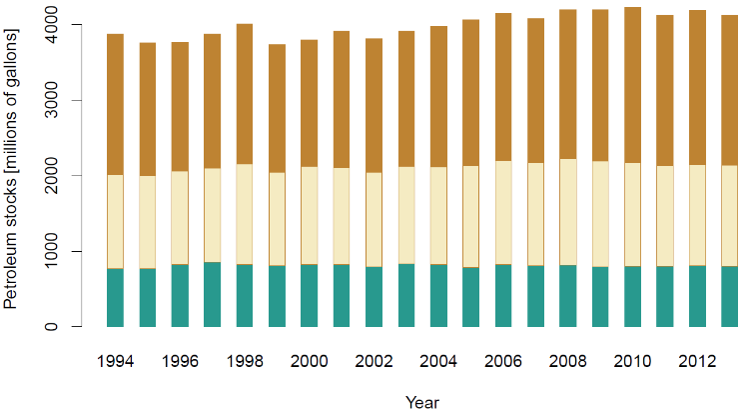
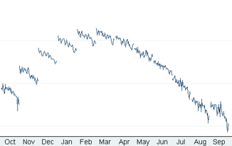

## Welcome

The workshop has three sessions focusing on different aspects of storytelling with data. 

<table>
  <tr>
    <td></td>
    <td>[Day 1](day1.html) Limitations of common visual elements</td>
  </tr>
  <tr>
    <td></td>
    <td>[Day 2](day2.html) Expanding your graphical reprtoire</td>
  </tr>
  <tr>
    <td></td>
    <td>[Day 3](day3.html) Thinking critically about visual information, a case study</td>
  </tr>
</table>
