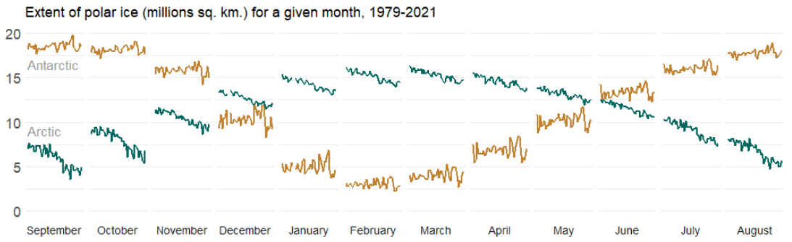

## Welcome

The workshop has three sessions focusing on different aspects of storytelling with data. 

<table>
  <tr>
    <td></td>
    <td>**Session 1** [Limitations of common graph types](session1.html)</td>
  </tr>
  
  <tr>
    <td></td>
    <td>**Session 2** [Expanding your graphical reprtoire](session2.html)</td>
  </tr>
  <tr>
    <td></td>
    <td>**Session 3** [Critical thinking about visual information](session3.html)</td>
  </tr>
</table>

