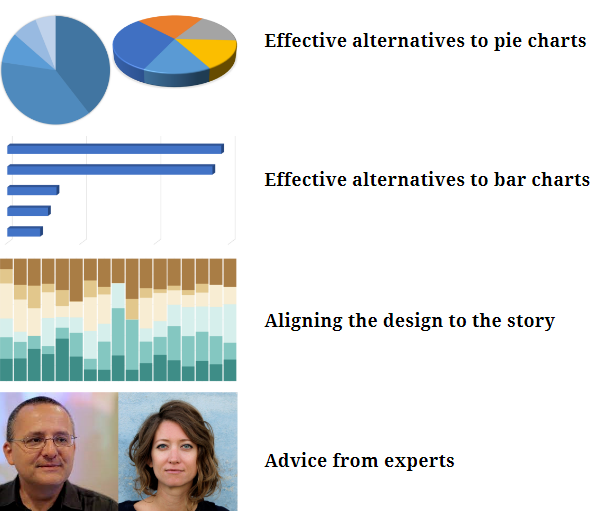
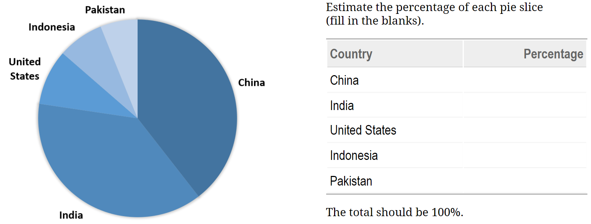
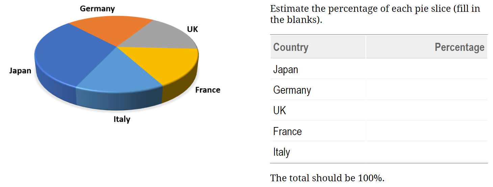
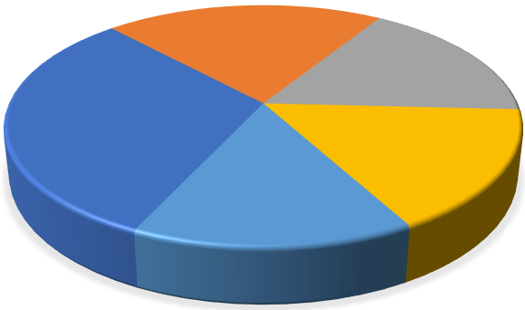
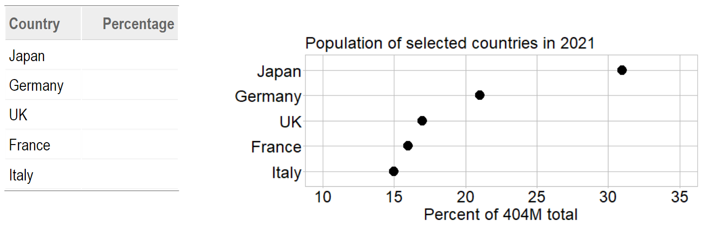
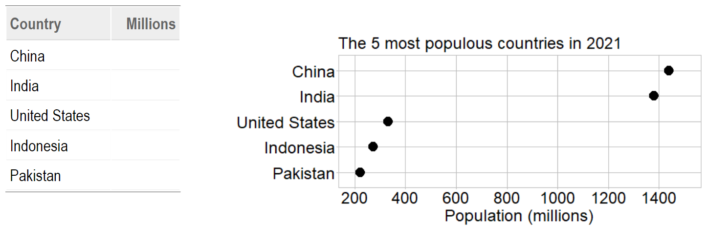
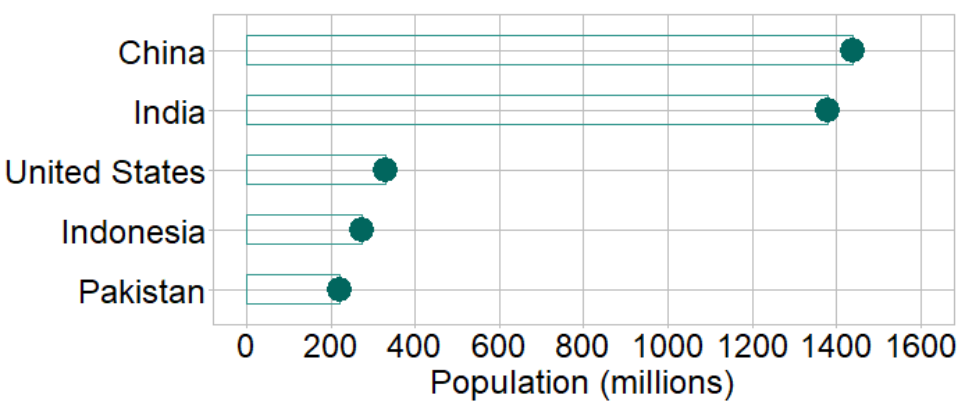
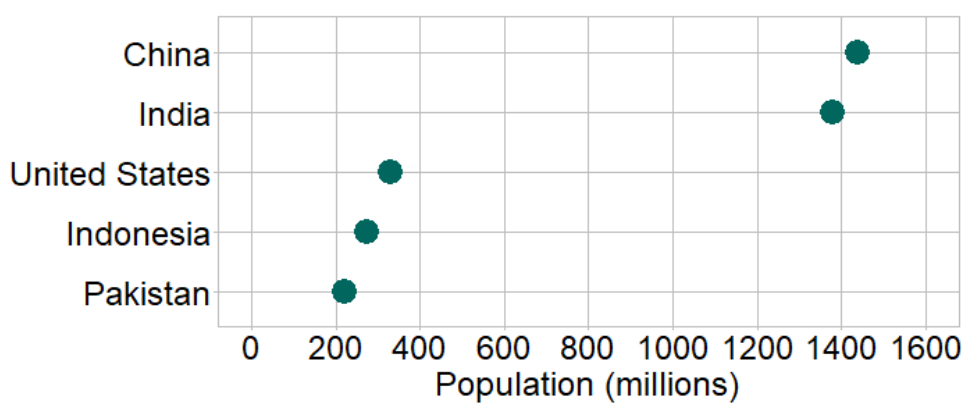
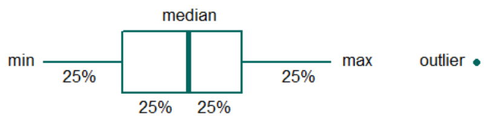
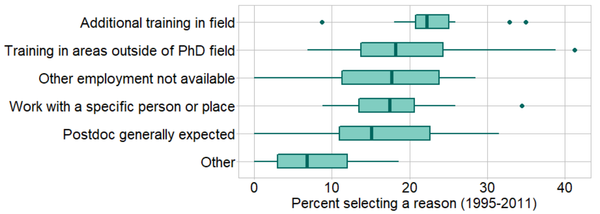

```{r setup, include=FALSE}
knitr::opts_chunk$set(echo=FALSE, warning=FALSE, message=FALSE)
knitr::opts_knit$set(root.dir = "../")

library(data.table)
library(ggplot2)
library(knitr)
library(graphclassmate)
library(magick)
library(docxtools)

library(tufte)
library(tufterhandout)
# invalidate cache when the tufte version changes
knitr::opts_chunk$set(cache.extra = packageVersion('tufte'))
options(htmltools.dir.version = FALSE)
```

# Limitations of common graph types: Four main topics

`r margin_note("I suggest you have a printed copy of these worksheets to write in during the workshop. We have a number of think-write-share activities that for many people work best when thoughts are written down.")`

{width="75%"}

```{r fig.height = 0.1}
put_gap()
```


# `r "\U00A7"` Effective alternatives to pie charts 


## Judging pie slices is a low-accuracy task[^1]

- Fill in the blanks with your visual estimates of each pie slice. 

- Total should be 100%

{width="140%"}    


## Judging values along a common axis is a high-accuracy task

```{marginfigure, echo = TRUE}
{width="50%"}    
```
`r margin_note("The data from the pie chart is shown below as dots along a common scale.")`

- The same data is displayed along a common scale.  

- Make new visual estimates (fill in the blanks). 

```{r fig.height = 0.3}
put_gap()
```

{width="150%"}

```{r fig.height = 1}
put_gap()
```


## 3D effects distort our judgment even further[^1]

- Fill in the blanks with your visual estimates of each pie slice 

- Total should be 100% 

{width="150%"}    


## Again, a common scale improves our visual judgments

```{marginfigure, echo = TRUE}
{width="50%"}    
```
`r margin_note("The data from the pie chart is shown below as dots along a common scale.")`

- The same data is displayed along a common scale. 

- Make new visual estimates (fill in the blanks). 

```{r fig.height = 0.2}
put_gap()
```

{width="150%"}

```{r fig.height = 1}
put_gap()
```


# `r "\U00A7"` Effective alternatives to bar charts 


## 3D effects always distort our judgment[^1]

- Fill in the blanks with your visual estimates of each bar length 

{width="150%"}
 
```{r fig.height = 0.2}
put_gap()
```


## Same data---without 3D effects---along a common scale

```{marginfigure, echo = TRUE}
{width="50%"}    
```
`r margin_note("The data from the 3D bar chart is shown below as dots along a common scale.")`

- The same data is displayed along a common scale 

- Make new visual estimates (fill in the blanks). 

```{r fig.height = 0.2}
put_gap()
```

{width="150%"}

```{r fig.height = 1}
put_gap()
```


## With a zero baseline and no 3D effects, bars are OK

- Bar charts must have a zero baseline to avoid deception.

- Ordering rows by the data values facilitates visual comparisons.

- The only information in the bar is the position of its end point. The bar itself is superfluous.

- Dot charts allow direct visual comparison of quantities.

- Dot charts are effective replacements for pie charts and bar charts.

```{marginfigure, echo = TRUE}
Default bar chart:

Ordered by magnitude:

Omitting the fill color:

Produces a dot chart:

```


## Notes
````{r fig.height = 1}
put_gap()
```


# `r "\U00A7"` Aligning the design to the story

## Survey: “What was your reason for taking this postdoc?”[^2] 

Before we can talk about what the chart *says*, we have to agree on what it *shows*.

````{r fig.height = 0.2}
put_gap()
```

{width="150%"}


`r newthought("")`Write your responses below. 

- What does a color represent?

````{r fig.height = 1}
put_gap()
```

- What does a single color-segment of a bar represent?

````{r fig.height = 1}
put_gap()
```

- What does the changing height over time of a segment represent?

````{r fig.height = 0.5}
put_gap()
```


## What ideas are conveyed by the chart?[^2]  

We agree on what the chart *shows*; now we can consider what it *says*.  

````{r fig.height = 0.2}
put_gap()
```

{width="150%"}

`r newthought("")`Write your responses below. 

- Describe a trend for one of the six reasons for obtaining postdoc training.

````{r fig.height = 1.5}
put_gap()
```

- Compare two of the reasons over time.  

````{r fig.height = 1.5}
put_gap()
```

- Describe the main idea this chart conveys to you. 

````{r fig.height = 0.5}
put_gap()
```


# What can we say about the variables?[^2]   

Choosing an effective chart design depends in part on what variables you have.   

````{r fig.height = 0.2}
put_gap()
```

{width="150%"}

````{r fig.height = 0.4}
put_gap()
```

`r newthought("Fill in the blanks")` to begin summarizing the data structure.  

1. Time (discrete years) is one categorical variable.`r margin_note("Note that discrete time units are not 'continuous', so the time units here are a categorical (not quantitative) variable.")`

2. The other categorical variable is ___________________________ . 

3. The quantitative variable is ___________________________ .

4. Which is the independent variable? ___________________________ . 

````{r fig.height = 2.3}
put_gap()
```

 


# The appropriate design for a time series is a line graph[^2] 

Separating the reasons into individual panels clarifies the data

````{r fig.height = 0.1}
put_gap()
```

{width="125%"}

- Describe the main idea this chart conveys to you.


````{r fig.height = 2}
put_gap()
```


# Conventions of the box-and-whisker plot

Designed to show a summary of the distribution of a single quantitative variable. 

````{r fig.height = 0.2}
put_gap()
```

{width="75%"}

````{r fig.height = 0.5}
put_gap()
```


# Our final design shows distributions of annual percentages[^2] 

{width="130%"}

````{r fig.height = 0.2}
put_gap()
```

- Describe the main idea(s) this chart conveys to you.

````{r fig.height = 4.5}
put_gap()
```


# `r "\U00A7"` Advice from experts

Match the expert to the advice.[^3][^4][^5][^6]  

`r newthought("Fill in the blanks")` with letters A--D. 

```{r}
x <- wrapr::build_frame(
  "Expert", "Letter", "Emphasizes the importance of"|
  " ", " ", " "|
  "A. Alberto Cairo"      , "______" , "message"|
  " ", " ", " "|
    
  "B. Jean-luc Doumont"   , "______" , "variables"|
  " ", " ", " "|
    
  "C. Stephanie Evergreen", "______" , "revealing the complex"|
    " ", " ", " "|
    
  "D. Edward Tufte"       , "______" , "knowing your main point"|
  " ", " ", " "|
    
  " "                     , "______" , "not lying to yourself"|
    
  " ", " ", " ")

knitr::kable(x)
```

````{r fig.height = 0.3}
put_gap()
```


# Ideas to consider

- Characterize the data structure and content

````{r fig.height = 0.2}
put_gap()
```

- Explore a story's context, causality, and complexity

````{r fig.height = 0.2}
put_gap()
```

- Align visual and verbal logic by revising iteratively

````{r fig.height = 0.2}
put_gap()
```

- Edit to suit the rhetorical goals for each audience

````{r fig.height = 0.2}
put_gap()
```

- Control every pixel---avoid thoughtless conformity

````{r fig.height = 0.2}
put_gap()
```

- Question are you seeing only what you want to believe?


[^1]: Data source: @WorldBank:2022
[^2]: Data adapted from @Main+Wang+Tan:2021
[^3]: @Cairo:2019
[^4]: @Doumont:2009
[^5]: @Evergreen:2017
[^6]: @Tufte:1983


# References


