```{r setup, include=FALSE}
knitr::opts_chunk$set(echo=FALSE, warning=FALSE, message=FALSE)
knitr::opts_knit$set(root.dir = "../")

library(data.table)
library(ggplot2)
library(knitr)
library(graphclassmate)
library(magick)
library(docxtools)

library(tufte)
library(tufterhandout)
# invalidate cache when the tufte version changes
knitr::opts_chunk$set(cache.extra = packageVersion('tufte'))
options(htmltools.dir.version = FALSE)
```

# Expanding your graphical repertoire: Four main topics[^1] 

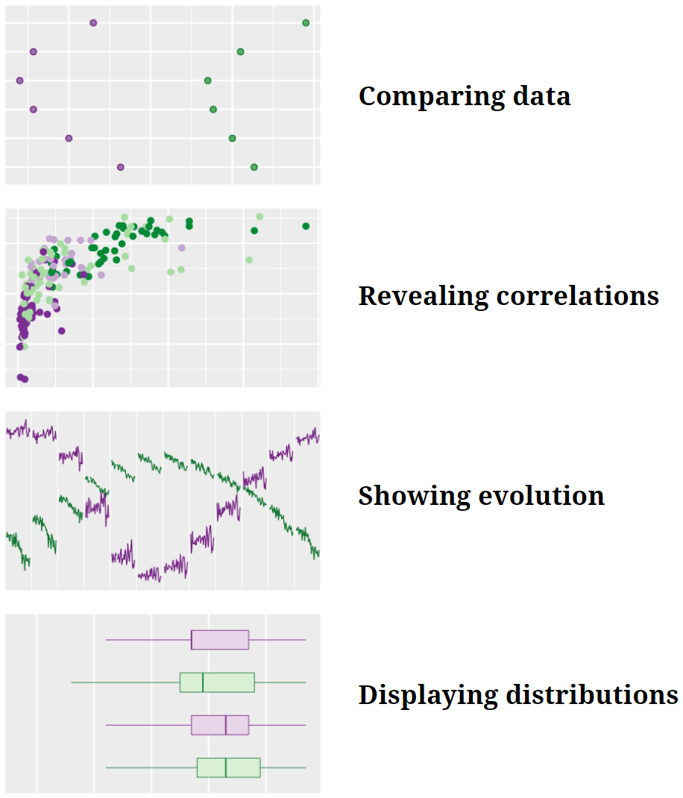{width="75%"}

`r margin_note("I suggest you have a printed copy of these worksheets to write in during the workshop. We have a number of think-write-share activities that for many people work best when thoughts are written down.")`

```{r fig.height = 0.1}
put_gap()
```

# Notes 

```{r fig.height = 2}
put_gap()
```


# `r "\U00A7"` Comparing data


## Dot plot

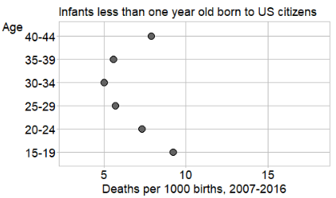{width="80%"}    
`r newthought("data from")`[^2]    

```{r fig.height = 0.2}
put_gap()
```

- Describe the main idea(s) this chart conveys to you.

```{marginfigure, echo = TRUE}
$\quad$
  
*Variables + Argument &#x2192; Design*
  
$\quad$

*Variables*: (1) quamtity, (1) category
  
$\quad$
  
*Argument*: Comparison
```

```{r fig.height = 2}
put_gap()
```

- What questions does the chart raise?

```{r fig.height = 2}
put_gap()
```


## Multiway dot chart, superposed

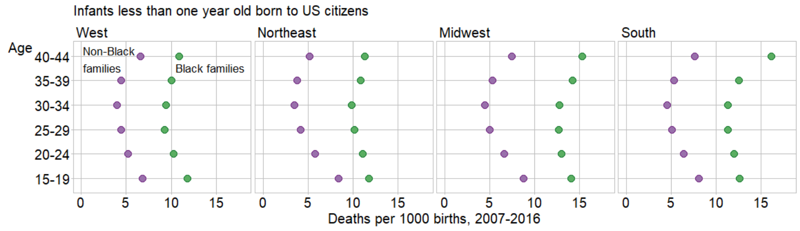{width="160%"}    
`r newthought("data from")`[^2]    

```{r fig.height = 0.2}
put_gap()
```

- Describe the main idea(s) this chart conveys to you.

```{marginfigure, echo = TRUE}
$\quad$
  
*Variables + Argument &#x2192; Design*
  
$\quad$

*Variables*: (1) quamtity, (3) categories

$\quad$
  
*Argument*: Comparison
```

```{r fig.height = 2}
put_gap()
```

- What questions does the chart raise?

```{r fig.height = 2}
put_gap()
```


# `r "\U00A7"` Revealing correlations


## Scatterplot

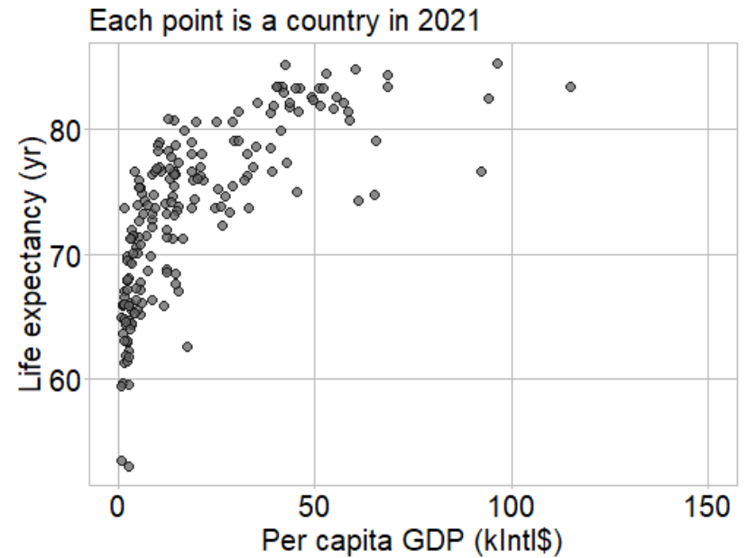{width="80%"}    
`r newthought("data from")` [^3][^4]    

```{r fig.height = 0.2}
put_gap()
```

- Describe the main idea(s) this chart conveys to you.

```{marginfigure, echo = TRUE}
$\quad$
  
*Variables + Argument &#x2192; Design*

$\quad$

*Variables*: (2) quamtities

$\quad$

*Argument*: Correlation
```

```{r fig.height = 2}
put_gap()
```

- What questions does the chart raise?

```{r fig.height = 1}
put_gap()
```


## Scatterplot, faceted

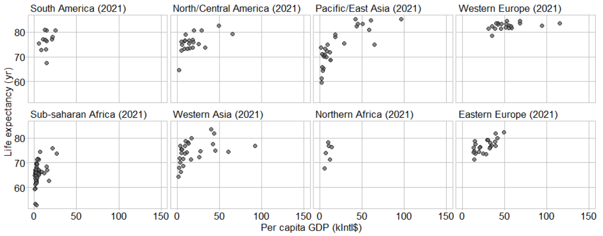{width="160%"}    
`r newthought("data from")` [^3][^4]    

```{r fig.height = 0.2}
put_gap()
```

- Describe the main idea(s) this chart conveys to you.

```{marginfigure, echo = TRUE}
$\quad$
  
*Variables + Argument &#x2192; Design*
  
$\quad$

*Variables*: (2) quamtities, (1) category

$\quad$
  
*Argument*: Correlation & comparison
```

```{r fig.height = 2}
put_gap()
```

- What questions does the chart raise?

```{r fig.height = 1}
put_gap()
```


# `r "\U00A7"` Showing evolution


## Time series

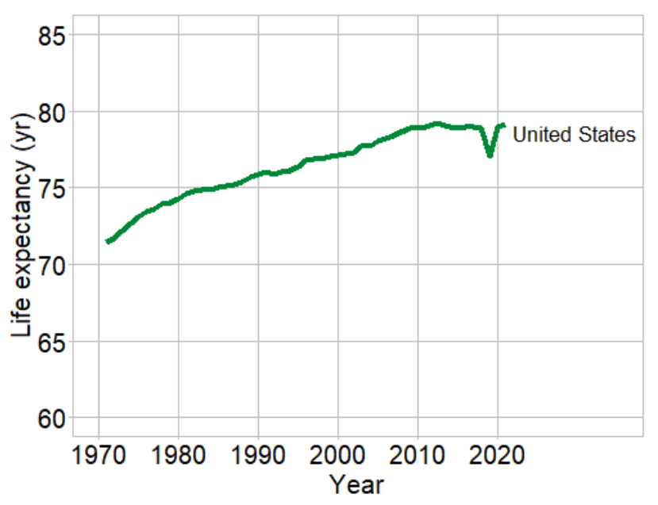{width="80%"}    
`r newthought("data from")`[^4]    

```{r fig.height = 0.2}
put_gap()
```

- Describe the main idea(s) this chart conveys to you.

```{marginfigure, echo = TRUE}
$\quad$
  
*Variables + Argument &#x2192; Design*
  
$\quad$

*Variables*: Discrete time, (1) quantity
  
$\quad$
  
*Argument*: Evolution
```

```{r fig.height = 2}
put_gap()
```

- What questions does the chart raise?

```{r fig.height = 1}
put_gap()
```


## Time series, faceted

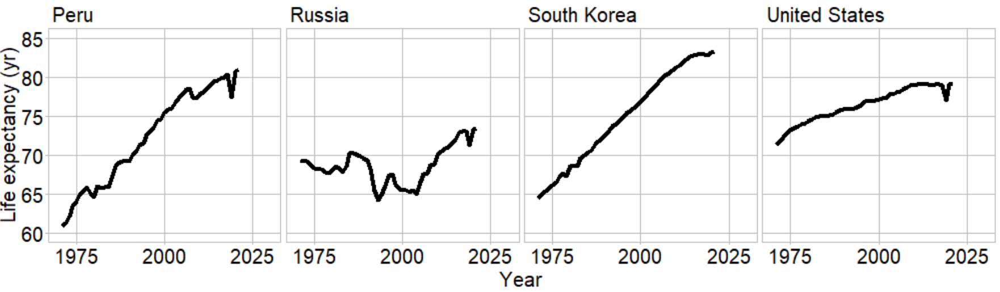{width="160%"}    
`r newthought("data from")`[^4]    

```{r fig.height = 0.2}
put_gap()
```

- Describe the main idea(s) this chart conveys to you.

```{marginfigure, echo = TRUE}
$\quad$
  
$\quad$

*Variables + Argument &#x2192; Design*

$\quad$

*Variables*: Discrete time,    
(1) quantity, (1) category

$\quad$

*Argument*: Evolution & comparison
```

```{r fig.height = 2}
put_gap()
```

- What questions does the chart raise?

```{r fig.height = 2}
put_gap()
```


## Connected scatterplot, faceted

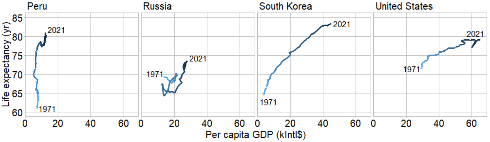{width="160%"}    
`r newthought("data from")` [^3][^4]    

```{r fig.height = 0.2}
put_gap()
```

- Describe the main idea(s) this chart conveys to you.

```{marginfigure, echo = TRUE}
$\quad$
  
*Variables + Argument &#x2192; Design*
  
$\quad$

*Variables*: Discrete time,    
(2) quantities, (1) category
  
$\quad$
  
*Argument*: Evolution, correlation,    
& comparison
```

```{r fig.height = 2}
put_gap()
```

- What questions does the chart raise?

```{r fig.height = 2}
put_gap()
```


## Cyclic time series, superposed

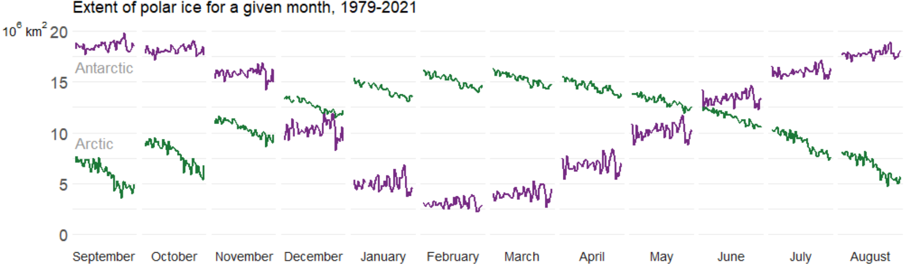{width="160%"}    
`r newthought("data from")`[^5]    

```{r fig.height = 0.2}
put_gap()
```

- Describe the main idea(s) this chart conveys to you.

```{marginfigure, echo = TRUE}
$\quad$
  
$\quad$
  
*Variables + Argument &#x2192; Design*
  
$\quad$

*Variables*: Discrete time,    
(1) quantity, (2) categories
  
$\quad$
  
*Argument*: Evolution & comparison
```

```{r fig.height = 2}
put_gap()
```

- What questions does the chart raise?

```{r fig.height = 2}
put_gap()
```


# `r "\U00A7"` Displaying distributions


## Strip chart, superposed

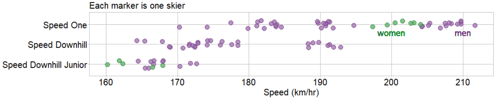{width="160%"}    
`r newthought("data from")`[^6]    

```{r fig.height = 0.2}
put_gap()
```

- Describe the main idea(s) this chart conveys to you.

```{marginfigure, echo = TRUE}
$\quad$
  
*Variables + Argument &#x2192; Design*
  
$\quad$

*Variables*: (1) quantity, (2) categories
  
$\quad$
  
*Argument*: Distribution & comparison
```

```{r fig.height = 2}
put_gap()
```

- What questions does the chart raise?

```{r fig.height = 2}
put_gap()
```


## Box and whisker chart

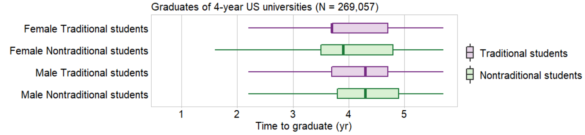{width="160%"}    
`r newthought("data from")`[^7]    
    
```{r fig.height = 0.2}
put_gap()
```

- Describe the main idea(s) this chart conveys to you.

```{marginfigure, echo = TRUE}
$\quad$
  
$\quad$
  
*Variables + Argument &#x2192; Design*
  
$\quad$

*Variables*: (1) quantity, (2) categories
  
$\quad$
  
*Argument*: Distribution & comparison
```

```{r fig.height = 2}
put_gap()
```

- What questions does the chart raise?

```{r fig.height = 2}
put_gap()
```


# Ideas to consider

\begin{fullwidth}
\subsection{Chart selection}
\begin{itemize}
\item What are your variables, by name?
\item Is a variable quantitative or categorical?
\item Is a categorical variable naturally ordered (ordinal) or not (nominal)?
\item Starting with a small number of variables, what chart types match the data structure?
\item How does the chart type change as you add new variables?
\end{itemize}

$\quad$

\subsection{Chart aesthetics}
\begin{itemize}
\item Superposed designs work best with small numbers of subsets or when the subsets visually cluster.
\item Faceted designs permit a greater number of subsets to be compared.
\item Deliberately assign the size, shape, and color of every visual element.
\item Use color deliberately. Choose colors that are safe for color-vision-deficient viewers.
\end{itemize}

$\quad$

\subsection{Audience and message}
\begin{itemize}
\item What is your story?
\item Does the visual evidence directly support your verbal argument?
\item Have you placed the story in context visually?
\item Who is your audience?
\item Will the audience resist your conventions?
\item If so, is overcoming audience resistance worth the effort?
\end{itemize}

$\quad$

\subsection{Ethics of visual rhetoric}
\begin{itemize}
\item Is your design equitable and inclusive?
\item Are you seeing only what you want to see? What the audience wants to see?
\item All there alternative explanations for what the chart shows?
\item Are your data dubious? Insufficient?
\item Have you concealed information? Concealed a large uncertainty?
\item Does your chart suggest misleading patterns?
\end{itemize}
\end{fullwidth}

```{r fig.height = 0.5}
put_gap()
```

[^1]: The four main types of argument are adapted from @Doumont:2009. 
[^2]: @CDC-Wonder:2022
[^3]: @Gapminder+GDP:2022    
[^4]: @Gapminder+LifeExp:2022  
[^5]: @NASA+Snow+Ice:2017 
[^6]: @R-GDAdata  
[^7]: @R-graphclassmate 

# References


