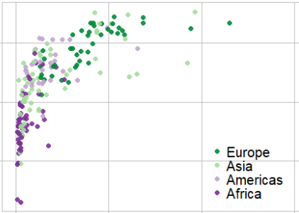

```{r setup, include=FALSE}
options(htmltools.dir.version = FALSE)
knitr::opts_chunk$set(echo=FALSE, warning=FALSE, message=FALSE)
knitr::opts_knit$set(root.dir = "../")

library("data.table")
library("ggplot2")
library("knitr")
library("kableExtra")
library("graphclassmate")
library("wrapr")
library("gapminder")

my_table <- function(x){
 x %>% 
  kbl(col.names = NULL) %>%
  kable_styling(position = "float_left", font_size = 18) %>%
  column_spec(1, background = "white") %>%
  column_spec(2, background = "white")  %>%
  add_header_above(c("Data structure" = ncol(x)))
}
```

class: right


.pull-left[
    
    
    
]

.pull-right[
# Expanding your graphical repertoire

<br>

<br>

Richard Layton   

2022-02-14

<br>

<br>

<https://graphdr.github.io/data-stories/>

<https://github.com/graphdr>

<a href="mailto:graphdoctor@gmail.com">graphdoctor@gmail.com</a>
]


---
class: left

# Design depends on data structure and visual purpose

.pull-left[
Comparing data

$\quad$ **dot chart** &mdash; *superposed*

$\quad$ **multiway** &mdash; *superposed, faceted*

$\quad$ 

Revealing correlations

$\quad$ **scatterplot**  &mdash; *superposed, faceted*

$\quad$ 

Showing evolution

$\quad$ **time series**  &mdash; *superposed, faceted*

$\quad$ **cyclic time series**  &mdash; *superposed*
]

.pull-right[
Displaying distributions 

$\quad$ **strip chart** &mdash; *comparative, superposed*

$\quad$ **box and whisker chart** &mdash; *comparative*

$\quad$ 

Multivariate designs to investigate on your own 

- conditioning (co-plot) chart
- diverging stacked bar chart
- parallel coordinate chart 
- financial (OHLC) chart
- scatterplot matrix 
- dot density map 

]

<div class="my-footer">
<span>
Optimal design categories from: Jean-luc Doumont (2009) <em>Trees, Maps and Theorems</em>, Principiae, p. 133.
</span>
</div> 


---
class:inverse, center, middle

# Comparing data


---
class: left

# Dot chart

The dot chart and its superposed and faceted derivatives are good substitutes  for pie and bar charts.

.pull-left[
```{r echo=FALSE, fig.width=7, fig.asp=1/1.7}
dt <- readRDS("data/dot-chart.rds")
ggplot(dt, aes(x = per_thou, y = age)) +
  geom_point(size = 5, shape = 16, color = rcb("dark_BG")) + 
  theme_graphclass(font_size = 18) +
  labs(x = "US infant deaths per 1000 births, 2007-2016", 
       y = "Age", 
       title = "All US regions") +
  scale_x_continuous(limits = c(3, 18), breaks = seq(0, 50, 5)) +
  theme(axis.title.y = element_text(angle = 0, hjust = 1, vjust = 1))
```
]
.pull-right[

<br>

```{r echo=FALSE}
x <- build_frame(
   "variable"         , "structure" |
   "infant mortality" , "quantitative" |
   "mother's age"     , "categorical, ordinal, 6 levels")
my_table(x)
```

<br>

<br>

<br>

- 1 category: levels on rows    

- 1 quantity: common horizontal scale
]

<div class="my-footer">
<span>Data source: US Centers for Disease Control and Prevention  
<a href="https://wonder.cdc.gov/lbd-current.html">CDC WONDER Linked Birth / Infant Death Records</a></span>
</div> 


---
class: left

# Dot chart, superposed

Subset by a second category.  

.pull-left[
```{r echo=FALSE, fig.width=7, fig.asp=1/1.7}
dt <- readRDS("data/multiway-2-panel.rds")

# label data
age      <- c("15-19")
race     <- c("Non-Black", "Black")
per_thou <- c(5.5, 13)
my_text  <- data.table(age, race, per_thou)

ggplot(dt, aes(x = per_thou, y = age, color = race, fill = race)) +
  geom_point(size = 5, shape = 21) + 
  theme_graphclass(font_size = 18) +
  labs(x = "US infant deaths per 1000 births, 2007-2016", 
       y = "Age", 
       title = "All US regions") + 
  scale_x_continuous(limits = c(3, 18), breaks = seq(0, 50, 5)) +
  theme(axis.title.y = element_text(angle = 0, hjust = 1, vjust = 1), 
        legend.position = "none") +
  scale_color_manual(values = c(rcb("dark_BG"), rcb("dark_BG"))) +
  scale_fill_manual(values = c(rcb("dark_BG"), "white")) +   
  geom_text(data = my_text, 
            mapping = aes(x = per_thou, y = 5.55, label = race),
            hjust = c(0, 0), 
            size = 6, 
            color = "black")
```
]
.pull-right[

<br>

```{r echo=FALSE}
x <- build_frame(
   "variable"         , "structure" |
   "infant mortality" , "quantitative" |
   "mother's age"     , "categorical, ordinal, 6 levels" |
   "mother's race"    , "categorical, nominal, 2 levels")
my_table(x)
```

<br>

<br>

<br>

- 2 categories: levels by row and by color

- 1 quantity: common horizontal scale
]

<div class="my-footer">
<span>Data source: US Centers for Disease Control and Prevention  
<a href="https://wonder.cdc.gov/lbd-current.html">CDC WONDER Linked Birth / Infant Death Records</a></span>
</div> 


---
class: left

# Multiway dot chart

Same data but changing the superposed design to a faceted design. 

.pull-left[
```{r echo=FALSE, fig.width=7, fig.asp=1/1.7}
dt <- readRDS("data/multiway-2-panel.rds")
ggplot(dt, aes(x = per_thou, y = age)) +
  geom_point(size = 5, shape = 16) + 
  facet_wrap(vars(reorder(race, per_thou, median)), as.table = FALSE) + 
  theme_graphclass(font_size = 18) +
  labs(x = "US infant deaths per 1000 births, 2007-2016", 
       y = "Age") + 
  scale_x_continuous(limits = c(3, 18), breaks = seq(0, 50, 5)) +
  theme(axis.title.y = element_text(angle = 0, hjust = 1, vjust = 1))
```
]
.pull-right[

<br>

```{r echo=FALSE}
x <- build_frame(
   "variable"         , "structure" |
   "infant mortality" , "quantitative" |
   "mother's age"     , "categorical, ordinal, 6 levels" |
   "mother's race"    , "categorical, nominal, 2 levels")
my_table(x)
```

<br>

<br>

<br>

- 2 categories: levels by row and by facet

- 1 quantity: common horizontal scale
]

<div class="my-footer">
<span>Data source: US Centers for Disease Control and Prevention  
<a href="https://wonder.cdc.gov/lbd-current.html">CDC WONDER Linked Birth / Infant Death Records</a></span>
</div> 


---
class: left

# Multiway dot chart

New category changes the number of facets. 

```{r echo=FALSE, fig.asp=0.27, fig.width=16}
dt <- readRDS("data/multiway-4-panel.rds")
ggplot(dt, aes(x = per_thou, y = age)) +
  facet_wrap(vars(reorder(region, per_thou, median)), ncol = 4) +
  geom_point(size = 5, shape = 16) + 
  theme_graphclass(font_size = 20) +
  labs(x = "US infant deaths per 1000 births, 2007-2016", 
       y = "Age") + 
  scale_x_continuous(limits = c(3, 18), breaks = seq(0, 50, 5)) +
  theme(axis.title.y = element_text(angle = 0, hjust = 1, vjust = 1))
```
.left[
```{r echo=FALSE}
x <- build_frame(
   "variable"         , "structure" |
   "infant mortality" , "quantitative" |
   "mother's age"     , "categorical, ordinal, 6 levels" |
   "US region"        , "categorical, nominal, 4 levels" )
my_table(x)
```
].pull-right[
- Rows ordered by age. 

- Facets ordered by median value. 
]

<div class="my-footer">
<span>Data source: US Centers for Disease Control and Prevention  
<a href="https://wonder.cdc.gov/lbd-current.html">CDC WONDER Linked Birth / Infant Death Records</a></span>
</div> 


---
class: left

# Multiway dot chart

Switching facet and row categories to change the visual comparison. 

```{r echo=FALSE, fig.asp=0.2, fig.width=16}
dt <- readRDS("data/multiway-4-panel.rds")
ggplot(dt, aes(x = per_thou, y = reorder(region, per_thou, median))) +
  facet_wrap(vars(age), ncol = 6, as.table = FALSE) +
  geom_point(size = 5, shape = 16) + 
  theme_graphclass(font_size = 20) +
  labs(x = "US infant deaths per 1000 births, 2007-2016", 
       y = "") + 
  scale_x_continuous(limits = c(3, 18), breaks = seq(0, 50, 5)) +
  theme(axis.title.y = element_text(angle = 0, hjust = 1, vjust = 1))
```
.left[
```{r echo=FALSE}
x <- build_frame(
   "variable"         , "structure" |
   "infant mortality" , "quantitative" |
   "mother's age"     , "categorical, ordinal, 6 levels" |
   "US region"        , "categorical, nominal, 4 levels" )
my_table(x)
```
]
.pull-right[
- Rows ordered by the median value.    

- Facets ordered by age. 
]

<div class="my-footer">
<span>Data source: US Centers for Disease Control and Prevention  
<a href="https://wonder.cdc.gov/lbd-current.html">CDC WONDER Linked Birth / Infant Death Records</a></span>
</div> 


---
class: left

# Multiway dot chart, superposed

Switch back and subset further by superposing a new category&mdash;for a total of 4 variables.   

```{r echo=FALSE, fig.asp=0.27, fig.width=16}
dt <- readRDS("data/multiway-superpose.rds")

# label data in one panel only
age      <- c("15-19")
region   <- c("West", "West")
race     <- c("Non-Black", "Black")
per_thou <- c(8, 10.5)
my_text  <- data.table(age, region, race, per_thou)

ggplot(dt, aes(x = per_thou, y = age, color = race, fill = race)) +
  facet_wrap(vars(reorder(region, region)), ncol = 4, as.table = FALSE) +
  geom_point(size = 5, shape = 21) + 
  theme_graphclass(font_size = 20) +
  labs(x = "US infant deaths per 1000 births, 2007-2016", 
       y = "Age") + 
  scale_x_continuous(limits = c(3, 18), breaks = seq(0, 50, 5)) +
  theme(axis.title.y = element_text(angle = 0, hjust = 1, vjust = 1), 
        legend.position = "none") +
  scale_color_manual(values = c(rcb("dark_BG"), rcb("dark_BG"))) +
  scale_fill_manual(values = c(rcb("dark_BG"), "white")) +   
  geom_text(data = my_text, 
            mapping = aes(x = per_thou, y = 5.55, label = race),
            hjust = c(1, 0), 
            size = 6, 
            color = "black")
```

.left[
```{r echo=FALSE}
x <- build_frame(
   "variable"         , "structure" |
   "infant mortality" , "quantitative" |
   "mother's age"     , "categorical, ordinal, 6 levels" |
   "US region"        , "categorical, nominal, 4 levels"  |
   "mother's race"    , "categorical, nominal, 2 levels")
my_table(x)
```
]

.pull-right[
- Direct labeling eliminates the legend. 

- Data marker contrast safe for color-vision-deficient viewers.
]

<div class="my-footer">
<span>Data source: US Centers for Disease Control and Prevention  
<a href="https://wonder.cdc.gov/lbd-current.html">CDC WONDER Linked Birth / Infant Death Records</a></span>
</div> 


---
class:inverse, center, middle

# Revealing correlations


---
class: left

# Scatterplot

Designed to reveal correlations between two quantitative variables.

.pull-left[
```{r echo=FALSE, fig.width=7, fig.asp=1/1.3}
dt <- readRDS(file = "data/scatterplot.rds")
dt <- dt[year == max(year)]
ggplot(dt, aes(x = per_capita_gdp/1000, y = lifeExp)) +
  geom_point(size = 3, alpha = 0.5) + 
  labs(x = "2021 GDP per capita (thousands Intl dollars)", 
       y = "Life expectancy in 2021 (years)", 
       title = "Each point is a country") + 
  scale_x_continuous(limits = c(0, 150)) +
  scale_y_continuous(breaks = seq(60, 80, 10)) +
  theme_graphclass(font_size = 20)
```
]
.pull-right[

<br>

```{r echo=FALSE}
x <- build_frame(
   "variable"        , "structure" |
   "life expectancy" , "quantitative" |
   "GDP per capita"  , "quantitative" )
my_table(x)
```

<br>

<br>

<br>

"International dollar" is a hypothetical currency with the same *purchasing power parity* (PPP) as constant US dollars (here, the basis is 2011).
]

<div class="my-footer">
<span>Data source:  
<a href="https://www.gapminder.org/data/">Gapminder Foundation</a></span>
</div> 


---
class: left

#  Scatterplot, superposed

Adding a categorical variable ("Global region") to compare data subsets.

.pull-left[
```{r echo=FALSE, fig.width=7, fig.asp=1/1.3}
dt <- readRDS(file = "data/scatterplot.rds")
dt <- dt[year == max(year)]
ggplot(dt, 
       aes(x = per_capita_gdp/1000, 
           y = lifeExp, 
           color = four_regions)) +
  geom_point(size = 3, 
             shape = 16, 
             alpha = 0.9) + 
  labs(x = "2021 GDP per capita (thousands Intl dollars)", 
       y = "Life expectancy in 2021 (years)", 
       title = "Each point is a country") + 
  scale_x_continuous(limits = c(0, 150)) +
  scale_y_continuous(breaks = seq(60, 80, 10)) +
  theme_graphclass(font_size = 20) +
  theme(legend.position = c(0.8, 0.2), 
        legend.title = element_blank()) +
  scale_color_brewer(
    palette = "PRGn",
    direction = 1
  ) +
  guides(color = guide_legend(reverse = TRUE))
```
]
.pull-right[

<br>

```{r echo=FALSE}
x <- build_frame(
   "variable"        , "structure" |
   "life expectancy" , "quantitative" |
   "GDP per capita"  , "quantitative" |
   "global region"   , "categorical, nominal, 4 levels")
my_table(x)
```

<br>

<br>

<br>

- Works best when clusters of subsets are distinct.

- Requires a legend if data cannot be directly labeled. 

]

<div class="my-footer">
<span>Data source:  
<a href="https://www.gapminder.org/data/">Gapminder Foundation</a></span>
</div> 


---
class: left

#  Scatterplot, faceted

Same three variables with "Global region" levels in 4 facets. 

```{r echo=FALSE, fig.asp=0.32, fig.width=16}
dt <- readRDS(file = "data/scatterplot.rds")
dt <- dt[year == max(year)]
ggplot(dt, 
       aes(x = per_capita_gdp/1000, 
           y = lifeExp)) +
  facet_wrap(vars(four_regions), ncol = 4) + 
  geom_point(size = 3, alpha = 0.5) + 
  labs(x = "2021 GDP per capita (thousands Intl dollars)", 
       y = "Life expectancy in 2021 (years)") + 
  scale_x_continuous(limits = c(0, 150)) +
  scale_y_continuous(breaks = seq(60, 80, 10)) +
  theme_graphclass(font_size = 20) +
  theme(legend.position = "none")
```

- A legend and color are no longer needed. 

- Facets are ordered by median life expectancy in "graph order."

<div class="my-footer">
<span>Data source:  
<a href="https://www.gapminder.org/data/">Gapminder Foundation</a></span>
</div> 


---
class: left

#  Scatterplot, faceted

Same three variables with "Global region" levels in 8 facets.

```{r echo=FALSE, fig.width=14, fig.asp=0.4}
dt <- readRDS(file = "data/scatterplot.rds")
ggplot(dt, aes(x = per_capita_gdp/1000, y = lifeExp)) +
  geom_point(size = 3, alpha = 0.5) + 
  labs(x = "2021 GDP per capita (thousands Intl dollars)", 
       y = "Life expectancy in 2021 (years)") + 
  facet_wrap(vars(reorder(eight_regions, lifeExp, median)), 
             ncol = 4, 
             as.table = FALSE) +
  scale_x_continuous(limits = c(0, 150)) +
  scale_y_continuous(breaks = seq(60, 80, 10)) +
  theme_graphclass(font_size = 18)
```

<div class="my-footer">
<span>Data source:  
<a href="https://www.gapminder.org/data/">Gapminder Foundation</a></span>
</div> 


---
class:inverse, center, middle

# Showing evolution


---
class: left

# Time series

Similar to a scatterplot with time as the independent variable.    

.pull-left[
```{r echo=FALSE, fig.width=7, fig.asp=1/1.3}
dt <- readRDS("data/time-series.rds")
ggplot(dt, aes(x = year, y = lifeExp)) +
  geom_line(linetype = 2) + 
  geom_point(size = 2) +
  labs(x = "Year", 
       y = "Life expectancy (years)") +
    theme_graphclass(font_size = 20) +
  scale_y_continuous(breaks = seq(50, 90, 10), limits = c(47, 83)) +
  annotate("text", 
           x = 1983, 
           y = c(73), 
           label = c("US"), 
           size = 6, 
           hjust = 0
  )
```
]

.pull-right[

<br>

```{r echo=FALSE}
x <- build_frame(
   "variable"        , "structure" |
   "life expectancy" , "quantitative" |
   "year"            , "categorical, ordinal" )
my_table(x)
```

<br>

<br>

<br>

- Discrete time (e.g., months or years) is a categorical, not quantitative, variable.

- Dots connected by a dashed line (preferred)  
]

<div class="my-footer">
<span>Data source:  
<a href="https://www.gapminder.org/data/">Gapminder Foundation</a></span>
</div> 


---
class: left

# Time series, superposed

Time series conditioned by a categorical variable, with all lines in the same facet. 

.pull-left[
```{r echo=FALSE, fig.width=7, fig.asp=1/1.3}
dt <- readRDS("data/time-series-superpose.rds")
ggplot(dt, aes(x = year, y = lifeExp, color = country)) +
  geom_line(linetype = 2) + 
  geom_point(size = 2) +
  labs(x = "Year", 
       y = "Life expectancy (years)") +
  theme_graphclass(font_size = 20) +
  scale_y_continuous(breaks = seq(50, 90, 10), limits = c(47, 83)) +
  annotate("text", 
           x = 1983, 
           y = c(64, 73, 80), 
           label = c("Peru", "US", "Canada"), 
           size = 6, 
           hjust = 0
  ) +
  theme(legend.position = "none") +
  scale_color_manual(values = c(rcb("dark_BG"), rcb("light_BG"), rcb("mid_BG")))
```
]

.pull-right[

<br>

```{r echo=FALSE}
x <- build_frame(
  "variable"          , "structure" |
    "life expectancy" , "quantitative" |
    "year"            , "categorical, ordinal" |
    "country"         , "categorical, nominal, 3 levels")
my_table(x)
```

<br>

<br>

<br>

- Color is often used to distinguish superposed category levels.   

- Labels eliminate the need for a legend. 
]

<div class="my-footer">
<span>Data source:  
<a href="https://www.gapminder.org/data/">Gapminder Foundation</a></span>
</div> 


---
class: left

# Time series, superposed

Time series conditioned by a categorical variable, with all lines in the same facet.

.pull-left[
```{r echo=FALSE, fig.width=7, fig.asp=1/1.3}
dt <- readRDS("data/time-series-superpose.rds")
ggplot(dt, aes(x = year, y = lifeExp, color = country)) +
  geom_line(linetype = 1, size = 1.5) + 
  labs(x = "Year", 
       y = "Life expectancy (years)") +
  theme_graphclass(font_size = 20) +
  scale_y_continuous(breaks = seq(50, 90, 10), limits = c(47, 83)) +
  annotate("text", 
           x = 1983, 
           y = c(64, 73, 80), 
           label = c("Peru", "US", "Canada"), 
           size = 6, 
           hjust = 0
  ) +
  theme(legend.position = "none") +
  scale_color_manual(values = c(rcb("dark_BG"), rcb("light_BG"), rcb("mid_BG")))
```
]
.pull-right[

<br>

```{r echo=FALSE}
x <- build_frame(
  "variable"          , "structure" |
    "life expectancy" , "quantitative" |
    "year"            , "categorical, ordinal" |
    "country"         , "categorical, nominal, 3 levels")
my_table(x)
```

<br>

<br>

<br>

- Time series are often displayed as line charts to make the differences easier to see.
]

<div class="my-footer">
<span>Data source:  
<a href="https://www.gapminder.org/data/">Gapminder Foundation</a></span>
</div> 


---
class: left

#  Time series, faceted

Same three variables with more levels of the "Country" category. 

```{r echo=FALSE, fig.width=14, fig.asp=0.4}
dt <- readRDS("data/time-series-facet.rds") 
ggplot(dt, aes(x = year, y = lifeExp)) +
  geom_line(size = 1.5) + 
  labs(x = "Year", 
       y = "Life expectancy (years)") + 
  facet_wrap(vars(country), 
             ncol = 4, 
             as.table = FALSE) +
  scale_y_continuous(breaks = seq(55, 95, 10), limits = c(53, 87)) +
  scale_x_continuous(breaks = seq(1975, 2065, 15), limits = c(1970, 2025)) +
  theme_graphclass(font_size = 18) +
  geom_text(aes(x = 1970, y = 86.5, label = eight_regions), 
            hjust = 0.05, 
            size = 5, 
            color = rcb("mid_Gray"))
```

<div class="my-footer">
<span>Data source:  
<a href="https://www.gapminder.org/data/">Gapminder Foundation</a></span>
</div> 


---
class:left

# Time series, cyclic


```{r echo=FALSE, fig.width=14, fig.asp=0.32}
dt <- readRDS("data/time-series-cyclic.rds") 
dt <- dt[hemis == "Arctic"]
ggplot(dt, aes(x = year, y = extent)) +
  geom_line(size = 1, na.rm = TRUE, color = rcb("dark_BG")) +
  facet_wrap(vars(month), ncol = 12, strip.position = "bottom") +
  theme_minimal() +
  labs(x = "", 
       y = "", 
       title= "Extent of arctic ice (millions sq. km.) for a given month, 1979-2021") +
  theme(axis.text.x = element_blank(), 
        panel.grid.major.x = element_blank(), 
        panel.grid.minor.x = element_blank(), 
        strip.text = element_text(size = 14), 
        axis.text = element_text(size = 18), 
        plot.title = element_text(size = 18)
        ) +
  scale_y_continuous(limits = c(0, 20), breaks = seq(0, 20, 5))
```

.left-column[
A time series showing the behavior of cyclic sub-series.
]
.right-column[
```{r echo=FALSE}
x <- build_frame(
   "variable"   , "structure" |
   "ice extent" , "quantitative" | 
   "year"       , "categorical, ordinal, 43 levels" |
   "month"      , "categorical, ordinal, 12 levels" )
my_table(x)
```
]

<div class="my-footer">
<span>Data source: NASA National Snow and Ice Data Center  
<a href="https://nsidc.org/arcticseaicenews/sea-ice-tools/">Sea ice extent and area organized by year</a></span>
</div> 


---
class:left

# Time series, cyclic, superposed

```{r echo=FALSE, fig.width=14, fig.asp=0.32}
dt <- readRDS("data/time-series-cyclic.rds") 
my_text <- dt[month == "September" & year == "1979"]
ggplot(dt, aes(x = year, y = extent, color = hemis)) +
  geom_line(size = 1, na.rm = TRUE) +
  facet_wrap(vars(month), ncol = 12, strip.position = "bottom") +
  theme_minimal() +
  labs(x = "", 
       y = "", 
       title= "Extent of polar ice (millions sq. km.) for a given month, 1979-2021") +
  theme(axis.text.x = element_blank(), 
        panel.grid.major.x = element_blank(), 
        panel.grid.minor.x = element_blank(), 
        strip.text = element_text(size = 14), 
        axis.text = element_text(size = 18), 
        plot.title = element_text(size = 18), 
        legend.position = "none"
        ) +
  scale_color_manual(values = c(rcb("mid_Br"), rcb("dark_BG"))) +
  geom_text(data = my_text,
            mapping = aes(x = year, 
                          y = extent + c(2, -1.7), 
                          label = hemis),
            hjust = c(0, 0),
            size = 6,
            color = rcb("mid_Gray")) +
  scale_y_continuous(limits = c(0, 20), breaks = seq(0, 20, 5))
```
.left-column[
Adding *hemisphere* as a categorical variable. 
]
.right-column[
```{r echo=FALSE}
x <- build_frame(
   "variable"   , "structure" |
   "ice extent" , "quantitative" | 
   "year"       , "categorical, ordinal, 43 levels" |
   "month"      , "categorical, ordinal, 12 levels" |
   "hemisphere" , "categorical, nominal, 2 levels")
my_table(x)
```
]

<div class="my-footer">
<span>Data source: NASA National Snow and Ice Data Center  
<a href="https://nsidc.org/arcticseaicenews/sea-ice-tools/">Sea ice extent and area organized by year</a></span>
</div> 


---
class:inverse, center, middle

# Displaying distributions


---
class: left

# Strip chart

Designed to display the distribution of a single quantitative variable.

<br>

```{r, fig.asp = 0.15, fig.width = 16}
# full distribution, jittered
library("GDAdata")
set.seed(20181216)
ggplot(SpeedSki, aes(x = Speed, y = 0)) +
  geom_jitter(size = 5, width = 0, height = 0.2, alpha = 0.5) +
  scale_y_continuous(limits = 1.5 * c(-1, 1)) +
  theme_graphclass(font_size = 20) +
  labs(x = "Speed (km/hr)", 
       y = "", 
       title = "Each marker is one skier in one event") +
  theme(axis.text.y = element_blank(), 
        panel.grid.major.y = element_blank(), 
        panel.grid.minor.y = element_blank())
```

<br>

.pull-left[
```{r echo=FALSE}
x <- build_frame(
   "variable" , "structure" |
   "speed"    , "quantitative")
my_table(x)
```
]
.pull-right[
- Designed to show all data values

- Data markers "jittered" to mitigate overprinting
]

<div class="my-footer">
<span>Data source: 2011 World speed skiing competition, in the
<a href="https://CRAN.R-project.org/package=GDAdata">GDAdata</a> R package</span>
</div> 


---
class: left

# Strip chart, comparative

Subset by a category and distinguish levels by row.  

<br>

```{r, fig.asp = 0.2, fig.width = 16}
# full distribution, jittered
ggplot(SpeedSki, aes(x = Speed, y = reorder(Event, Speed, median))) +
  geom_jitter(size = 5, width = 0, height = 0.15, alpha = 0.4) +
  theme_graphclass(font_size = 20) +
  labs(x = "Speed (km/hr)", 
       y = "", 
       title = "Each marker is one skier") +
  theme(panel.grid.minor.y = element_blank())
```

.pull-left[
```{r echo=FALSE}
x <- build_frame(
   "variable"   , "structure" |
   "speed"      , "quantitative" |
   "event"      , "categorical, nominal, 3 levels")
my_table(x)
```
]
.pull-right[
- Rows ordered by median value

- Common horizontal scale 
]

<div class="my-footer">
<span>Data source: 2011 World speed skiing competition, in the
<a href="https://CRAN.R-project.org/package=GDAdata">GDAdata</a> R package</span>
</div> 


---
class: left

# Strip chart, comparative, superposed

Subset by another category and distinguish levels by color. 

<br>

```{r, fig.asp = 0.2, fig.width = 16}
# full distribution, jittered
ggplot(SpeedSki, aes(x = Speed, 
                     y = reorder(Event, Speed, median), 
                     color = Sex, 
                     fill = Sex)) +
  geom_jitter(size = 5, shape = 21, width = 0, height = 0.15) +
  theme_graphclass(font_size = 20) +
  labs(x = "Speed (km/hr)", 
       y = "", 
       title = "Each marker is one skier") +
  theme(panel.grid.minor.y = element_blank(), 
        legend.position = "none") +
  scale_color_manual(values = c(rcb("dark_BG"), rcb("dark_Br"))) +
  scale_fill_manual(values = c(rcb("mid_BG"), rcb("light_Br"))) + 
  geom_text(aes(x = 200, 
                y = 2.6, 
                label = "women"), 
            color = rcb("dark_BG"), 
            size = 7) +
  geom_text(aes(x = 210, 
                y = 2.6, 
                label = "men"), 
            color = rcb("dark_Br"), 
            size = 7)
```

.pull-left[
```{r echo=FALSE}
x <- build_frame(
   "variable"   , "structure" |
   "speed"      , "quantitative" |
   "event"      , "categorical, nominal, 3 levels", 
   "sex"        , "categorical, nominal, 2 levels")
my_table(x)
```
]
.pull-right[
- Direct labeling eliminates the legend

- Colors safe for color-vision-deficient viewers 
]

<div class="my-footer">
<span>Data source: 2011 World speed skiing competition, in the
<a href="https://CRAN.R-project.org/package=GDAdata">GDAdata</a> R package</span>
</div> 


---
class: left

# Box and whisker chart

Designed to summarize the distribution of a single quantitative variable.

<br>

```{r, fig.asp = 0.15, fig.width = 16}
dt <- readRDS("data/boxplot.rds")
ggplot(dt, aes(x = enrolled)) +
  geom_boxplot(size = 1, width = 0.5) +
  labs(x = "Time to graduate (years)", 
       y = "", 
       title = "Graduates of 4-year US universities (N = 269,057)") +
  theme_graphclass(font_size = 20) +
  theme(axis.text.y        = element_blank(), 
        panel.grid.major.y = element_blank(), 
        panel.grid.minor.y = element_blank(), 
        axis.ticks.y       = element_blank()) +
  scale_y_continuous(limits = c(-1, 1))
```

<br>

.pull-left[
```{r echo=FALSE}
x <- build_frame(
   "variable"   , "structure" |
   "years"      , "quantitative")
my_table(x)
```
]
.pull-right[
- Shows a 5-point summary of distributions 

- Useful when too much data for a strip chart 
]

<div class="my-footer">
<span>Data source: MIDFIELD subset from the 
<a href="https://github.com/graphdr/graphclassmate">graphclassmate</a> R package</span>
</div> 


---
class: left

# Box and whisker chart, comparative

Subset by a category and distinguish levels by row.

<br>

```{r, fig.asp = 0.16, fig.width = 16}
dt <- readRDS("data/boxplot-compare.rds")
ggplot(dt, aes(x = enrolled, y = reorder(path, -enrolled, median))) +
  geom_boxplot(size = 1, width = 0.45, outlier.shape = NA) +
  labs(x = "Time to graduate (years)", 
       y = "", 
       title = "Graduates of 4-year US universities (N = 269,057)") +
  theme_graphclass(font_size = 20) +
  theme(panel.grid.major.y = element_blank(), 
        panel.grid.minor.y  = element_blank(), 
        axis.ticks.y       = element_blank())
```

<br>

.pull-left[
```{r echo=FALSE}
x <- build_frame(
   "variable" , "structure" |
   "years"    , "quantitative" |
   "group"    , "categorical, nominal, 2 levels" )
my_table(x)
```
]
.pull-right[
- Convention "up" is "better", so row medians decrease from bottom to top

- Outliers omitted 
]

<div class="my-footer">
<span>Data source: MIDFIELD subset from the 
<a href="https://github.com/graphdr/graphclassmate">graphclassmate</a> R package</span>
</div> 


---
class: left

# Box and whisker chart, comparative

Merge two categories (path and sex) into a new "Group" category

<br>

```{r, fig.asp = 0.23, fig.width = 16}
dt <- readRDS("data/boxplot-merge-category.rds")
ggplot(dt, aes(x = enrolled, 
               y = reorder(sex_path, -enrolled, median), 
               fill = path, 
               color = path
               )) +
  geom_boxplot(size = 1, width = 0.45, outlier.shape = NA) +
  labs(x = "Time to graduate (years)", 
       y = "", 
       title = "Graduates of 4-year US universities (N = 269,057)") +
  theme_graphclass(font_size = 20) +
  theme(panel.grid.major.y = element_blank(), 
        panel.grid.minor.y  = element_blank(), 
        axis.ticks.y       = element_blank())+ 
  scale_color_manual(values = c(rcb("dark_BG"), rcb("dark_Br"))) +
  scale_fill_manual(values = c(rcb("light_BG"), rcb("light_Br"))) + 
  guides(fill = guide_legend(title = NULL, reverse = TRUE),
         color = "none")
```

  
<br>

.pull-left[
```{r echo=FALSE}
x <- build_frame(
   "variable" , "structure" |
   "years"    , "quantitative" |
   "group"    , "categorical, nominal, 4 levels" )
my_table(x)
```
]
.pull-right[
- Direct comparison easier without facets

- Colors and legend added for clarity 
]

<div class="my-footer">
<span>Data source: MIDFIELD subset from the 
<a href="https://github.com/graphdr/graphclassmate">graphclassmate</a> R package</span>
</div> 


---
class:inverse, center, middle

# Summary

## Chart design and rhetorical considerations


---
class: left

# Chart design

.pull-left[
**Chart selection** 

- What are your variables, by name?

- Is a variable quantitative or categorical?

- Is a categorical variable naturally ordered (ordinal) or not (nominal)?

- Starting with a small number of variables, what chart types match the data structure? 

- How does the chart type change as you add new variables?
]
.pull-right[
**Chart aesthetics**

- Superposed designs work best with small numbers of subsets or when the subsets visually cluster. 

- Faceted designs permit a greater number of subsets to be compared. 

- Use color  deliberately. Choose colors that are safe for color-vision-deficient viewers. 

- Deliberately assign the size, shape, and color of every graphical element: data points, lines, bars, grids, scale text, titles, labels, etc.&mdash;every pixel.  
]


---
class: left

# Rhetorical considerations

.pull-left[
**Audience and message** 

- What is your story?

- Does the visual evidence directly support your verbal argument? 

- Have you placed the story in context visually? 

- Who is your audience?

- Does the chart violate conventions expected by the audience?

- If so, is the violation worth the trouble of overcoming audience resistance? 
]
.pull-right[
**Ethics of visual rhetoric** 

- Have you lied to yourself by seeing what you want to see?

- Have you lied by catering to what the audience wants to see? 

- All there alternative explanations for what the chart shows? 

- Are your data dubious? 

- Are your data insufficient?

- Have you concealed information or concealed a large uncertainty? 

- Does your chart suggest misleading patterns? 


]


---
class:inverse, center, middle

