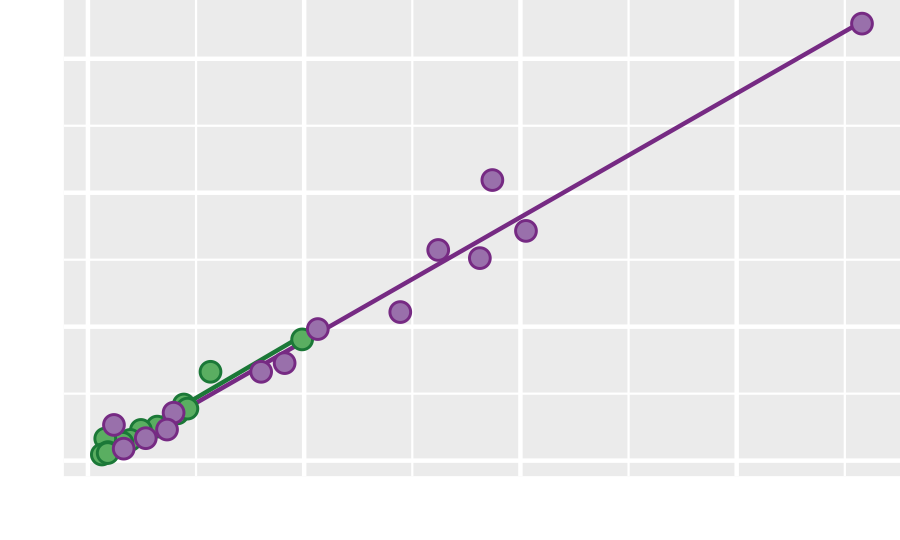

```{r setup, include=FALSE}
options(htmltools.dir.version = FALSE)
knitr::opts_chunk$set(echo = FALSE)

library(data.table)
library(ggplot2)
library(knitr)
library(kableExtra)
library(graphclassmate)
library("tidyverse")
library("seplyr")
library("cdata")
```

class: right

.left-column[
<!--  -->

<!--  -->

<!--  -->

<!--  -->
]

.right-column[
# Expanding your graphical repertoire

## Matching chart type to data structure

Richard Layton   

2022-02-14

<br>

<br>

<https://graphdr.github.io/data-stories/>

<https://github.com/graphdr>

<a href="mailto:graphdoctor@gmail.com">graphdoctor@gmail.com</a>
]


---
class: left

# Our goal is to match chart type to data structure

While incomplete, this list covers chart designs for a variety of commonly-encountered data structures. 

.pull-left[
**dot chart** 

**multiway dot chart** 
 
**scatterplot**  

**line graph**  

**facet or small multiple chart**

**cycle chart**  

**contour scatterplot**
]

.pull-right[
**strip chart**

**box and whisker chart** 

**q-q chart** 

**scatterplot matrix** 

**conditioning chart** 

**Sankey diagram**  

**diverging stacked-bar chart**
]


---
class: left

# Dot chart

```{r echo=FALSE}
data(infant_mortality, package = "graphclassmate")

df <- infant_mortality %>% 
  filter(!age %in% c("15","45-49"))

df <- df %>% 
  mutate(race = if_else(race == "Black", 
                        true   = "Black", 
                        false  = "non-Black"))

df <- df %>%  
        mutate(region = recode(region, 
                "CENS-R1" = "Northeast", 
                "CENS-R2" = "Midwest",
                "CENS-R3" = "South",
                "CENS-R4" = "West"))

grouping_variables <- c("age", "race")
df2 <- df %>% 
  seplyr::group_summarise(grouping_variables, 
                          deaths = sum(deaths, na.rm = TRUE), 
                          births = sum(births, na.rm = TRUE)) %>% 
  mutate(rate = deaths / births * 1000) %>% 
  filter(complete.cases(.))
```

.footnote[Data source: US Centers for Disease Control and Prevention (CDC) WONDER online database, https://wonder.cdc.gov/controller/datarequest/D69]

.left-column[
Data structure

- Age group: an ordinal category, 6 levels

- Mortality: a quantitative variable

- Race: a nominal category, 2 levels
]

.right-column[
```{r echo=FALSE, fig.asp=0.5, fig.width=10}
ggplot(df2, aes(x = rate, y = age, fill = race)) +
  geom_point(size = 5, shape = 21) + 
  theme_graphclass(font_size = 24) +
  labs(title = "US infant mortality by mother's race and age", 
       x = "Deaths per 1000 births, 2007-2016", y = "") +
  theme(legend.position = "none") +
  scale_fill_manual(values = c("black", "white")) +
  scale_x_continuous(limits = c(1, 15), breaks = seq(0, 100, 1)) +
  annotate("text",
           x = c(11.5, 4.5),
           y = 4.5,
           label = c("Black", "Non-Black"),
           size = 7,
           hjust = 1, 
           vjust = 0.3
  )
```
]


   
   


---
class: left

# Multiway dot chart

Same data structure plus "region", a nominal category with 4 levels. 

Multiway data are characterized by single quantitative variable dependent on two independent categorical variables


```{r echo=FALSE}
grouping_variables <- c("age", "race", "region")
df3 <- df %>% 
        seplyr::group_summarise(grouping_variables, 
                deaths = sum(deaths, na.rm = TRUE), 
                births = sum(births, na.rm = TRUE)) %>% 
        mutate(rate = deaths / births * 1000) %>% 
        filter(complete.cases(.))

df3 <- df3 %>%    
        mutate(region = fct_reorder(region, rate))
```


```{r echo=FALSE, fig.asp=0.36, fig.width=15}
ggplot(df3, aes(x = rate, y = age, fill = race)) +
  geom_point(size = 5, shape = 21) + 
        facet_wrap(vars(region), as.table = FALSE, ncol = 4) + 
  theme_graphclass(font_size = 24) +
  labs(title = "US infant mortality by mother's race, age, and region", 
       x = "Deaths per 1000 births, 2007-2016", y = "") +
  theme(legend.position = "none")+
  scale_fill_manual(values = c("black", "white"))
```

